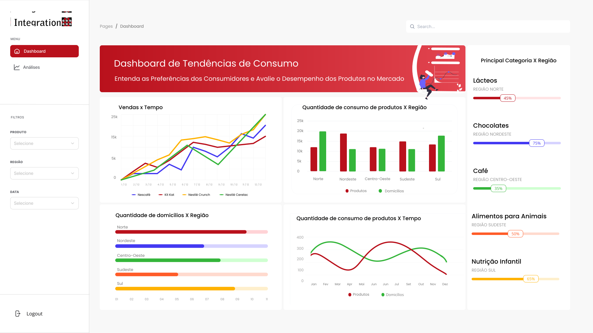

## Sumário

[1. Persona](#c1)

[2. Mapa de Jornada do Usuário](#c2)

[3. User Story](#c3)

[4. Mockup Interface (Preliminar) - Desktop](#c4)

 

# 1. Persona
&emsp;&emsp; As personas desempenham um papel essencial na compreensão e no direcionamento de qualquer projeto ou solução. Elas são representações fictícias, mas altamente detalhadas, dos tipos ideais de clientes que a solução visa atender. No caso deste projeto, que visa desenvolver uma consultoria de marketing e vendas baseada em Big Data, duas personas distintas foram criadas para melhor ilustrar os usuários que utilizarão nossa solução: a Consultora de Marketing e Vendas e o Analista de Dados.

&emsp;&emsp; Essas personas são baseadas em nos setores principais que são fundamentais para a eficácia da solução. Cada uma delas incorpora características, comportamentos e preferências que se alinham com o contexto em que a Integration, a empresa, se encontra. Essas personas não apenas ajudam a equipe a visualizar os usuários finais, mas também a definir estratégias e recursos que atendam às necessidades e expectativas de cada um desses perfis.

  

Figura 1: Persona - Consultora Marketing e Vendas   
Fonte: Elaboração própria

  
 

Figura 2: Persona - Analista de Dados   
Fonte: Elaboração própria

# 2. Mapa de Jornada do Usuário

&emsp;&emsp; A jornada do usuário construída consiste na representação das etapas principais que envolvem os consultores de marketing e vendas e o analista de dados. Ambos começam com o acesso à plataforma por meio de autenticação. A consultora se envolve com a análise de dados, usando um painel interativo no qual pode explorar informações sobre o potencial de consumo em categorias específicas, filtrar dados, criar relatórios personalizados e tomar decisões estratégicas. Por outro lado, o analista de dados utiliza o pipeline de dados para acessar e analisar dados brutos, conduzindo análises estatísticas detalhadas e preparando o infográfico final. Essa jornada do usuário proporciona uma experiência que permite que ambos os profissionais extraiam valor dos dados e forneçam informações valiosas para o cliente.

  

Figura 3: Jornada - Consultora Marketing e Vendas   
Fonte: Elaboração própria

  
 

Figura 4: Jornada - Analista de Dados   
Fonte: Elaboração própria

# 3. User Story

##  US00 - Configuração do Ambiente AWS

**Persona :** Analista de Dados

**História :** Como um analista de dados, quero configurar o ambiente AWS para armazenamento, preparação e análise de dados, a fim de estabelecer uma infraestrutura funcional.

**Critério de avaliação :**

- **Critério 1 :** Ambiente AWS configurado corretamente
  - Condição : { Verificar se o ambiente AWS foi configurado de acordo com as especificações. Isso inclui a presença e configuração correta do Amazon S3 para armazenamento, do AWS Glue para preparação de dados e do Apache Spark para análise estatística. } 
- **Critério 2 :** Serviços AWS estão operacionais e interconectados
  - Condição : { Verificar a operacionalidade de todos os serviços AWS listados na arquitetura. Além disso, é importante verificar se esses serviços estão conectados e podem se comunicar entre si conforme necessário. }
- **Critério 3 :** Documentação da infraestrutura disponível
  - Condição : { Existir uma documentação detalhada que descreve a configuração da infraestrutura, incluindo os serviços AWS utilizados, as configurações específicas de cada serviço e qualquer personalização realizada. A documentação deve ser abrangente para permitir referência futura e manutenção. }

**Teste de aceitação :**

1. **Teste 1 :** Serviços da AWS operacionais

   - Aprovado: { Os serviços da AWS estão operacionais e todos os componentes da aplicação estão funcionando sem problemas. } 
   - Recusado: { Os serviços da AWS estão inoperantes, resultando em uma interrupção dos serviços da aplicação. Os componentes da aplicação estão inacessíveis e não funcionam. }
  
2. **Teste 2 :** Os dados devem ser armazenados com sucesso no S3.
   -  Aprovado: { Os dados estão sendo armazenados com sucesso no Amazon S3. Os dados são acessíveis e podem ser recuperados sem problemas. }
   -  Recusado: { Não é possível armazenar dados no Amazon S3, ou os dados armazenados estão corrompidos e não podem ser recuperados. }

3. **Teste 3 :** Preparação de dados com Glue ou Lambda está funcionando corretamente.
   - Aprovado: { A preparação de dados com AWS Glue ou AWS Lambda está funcionando corretamente. Os dados são transformados e preparados para análise sem erros ou interrupções. } 
   - Recusado: { A preparação de dados com Glue ou Lambda está com falhas, causando erros na transformação dos dados ou impedindo que os dados estejam prontos para análise. }

**Notas :** Esta história é fundamental para a configuração inicial do ambiente AWS necessário para o pipeline de Big Data.

| **Prioridade** | **Estimativa** | **Relação** |
|----------|----------|----------|
| Alta | 4 dias | N/A |

  

##  US01 -  Ingestão de Dados

**Persona :** Analista de Dados

**História :** Como um analista de dados, quero implementar a ingestão de um conjunto de dados para fins de análise estatística, a fim de realizar testes iniciais.

**Critério de avaliação :**

- **Critério 1 :** Conjunto de dados disponibilizado e carregado com sucesso no ambiente AWS.
  - Condição : { Os dados de origem foram carregados com sucesso em um local de armazenamento, como o Amazon S3, e estão disponíveis para processamento. } 
- **Critério 2 :** Tolerância a falhas, visando segurança (redundância).
  - Condição : { Verificar se a implementação ocorreu com mecanismos de tolerância a falhas, seleção de backup, que garantam a segurança dos serviços e dados. }
- **Critério 3 :** Os dados devem ser de origem não estruturada.
  - Condição : { Analisar os tipos de dados, como documentos de texto, para confirmar que eles não seguem um formato estruturado, como tabelas de banco de dados. A aprovação deste requisito está relacionada à confirmação de que os dados são, de fato, não estruturados. }

**Teste de aceitação :**

1. **Teste 1 :** O conjunto de dados é carregado com sucesso no ambiente AWS.

   - Aprovado: { O conjunto de dados é carregado com sucesso no ambiente AWS sem erros ou problemas. Isso inclui a verificação de que os dados foram transferidos com precisão, que não houve perda de informações durante o processo de carga e que os dados estão acessíveis e disponíveis conforme o esperado. } 
   - Recusado: { Se ocorrerem erros durante o carregamento dos dados, se houver perda de informações críticas ou se os dados não estiverem disponíveis conforme o esperado no ambiente AWS. }
  
2. **Teste 2 :** Tolerância a falhas
   -  Aprovado: { Demonstração de tolerância a falhas e segurança através do uso de redundância adequada. Isso significa que o sistema é capaz de continuar operando mesmo em face de falhas em componentes individuais, garantindo que a disponibilidade e a integridade dos dados sejam mantidas. }
   -  Recusado: { Não apresentar tolerancia a falhas ou não demonstrar a segurança necessária por meio de redundância. Resultando em vulnerabilidades que comprometem a continuidade das operações e a segurança dos dados. }
  
3. **Teste 3 :** Os dados são verificados como não estruturados.
   - Aprovado: { Verificação dos dados for bem-sucedida, classificados como não estruturados conforme as expectativas. Os dados não seguem um formato ou padrão rígido e podem conter informações variadas. } 
   - Recusado: { Verificação dos dados identificar que eles são estruturados ou se houver dificuldades em determinar a natureza não estruturada dos dados. Podendo indicar que a classificação dos dados como não estruturados não foi realizada com sucesso. }

**Notas :** Esta história se concentra na ingestão de dados iniciais para testes.

| **Prioridade** | **Estimativa** | **Relação** |
|----------|----------|----------|
| Alta | 14 dias | US00 |

  

##  US02 - Análise Estatística Inicial

**Persona :** Analista de Dados

**História :** Como um analista de dados, quero realizar uma análise estatística inicial dos dados carregados no ambiente AWS, a fim de identificar tendências e padrões.

**Critério de avaliação :**

- **Critério 1 :** Os dados carregados são processados com sucesso.
  - Condição : { Os dados carregados passaram com sucesso por todo o processo de preparação, transformação e carga (ETL). Ou seja, os dados estão limpos, transformados adequadamente e prontos para análise. } 
- **Critério 2 :** Análises estatísticas descritivas
  - Condição : { As análises estatísticas foram executadas com sucesso nos dados preparados. As métricas estatísticas, como média, desvio padrão, histogramas ou outras métricas relevantes, foram geradas com precisão. }
- **Critério 3 :** Os resultados da análise são armazenados para validação posterior.
  - Condição : { Verificar se os resultados das análises estatísticas foram armazenados de forma adequada e estão disponíveis para validação posterior. Deve-se conter registros com os resultados das análises. }

**Teste de aceitação :**

1. **Teste 1 :** Os dados são processados com sucesso

   - Aprovado: { Verificar se os dados passaram por todas as etapas de transformação e limpeza, se aplicável, sem erros críticos. Os dados processados devem estar prontos para análises. } 
   - Recusado: { Se ocorrerem erros significativos durante o processamento dos dados, perda de informações importantes ou se os dados processados não estiverem prontos para uso, devido a problemas de qualidade ou integridade. }
  
2. **Teste 2 :** As análises estatísticas são geradas de forma precisa.
   -  Aprovado: { As análises estatísticas foram geradas de forma precisa e confiável, refletindo com precisão os dados processados. Isso inclui a verificação de que as métricas estatísticas, estão corretamente calculadas e representam os dados subjacentes. }
   -  Recusado: { As análises estatísticas geradas contém erros ou imprecisões significativas. Isso pode ocorrer devido a problemas nos cálculos ou nos dados de entrada. }

3. **Teste 3 :** Os resultados são armazenados e prontos para validação.
   - Aprovado: { Os resultados das análises são armazenados de forma adequada e estão prontos para validação. Ou seja, os resultados estão acessíveis, bem documentados e podem ser facilmente verificados por partes interessadas. } 
   - Recusado: { Os resultados das análises não foram armazenados corretamente, estão incompletos, ou não estão disponíveis para validação. }

**Notas :** Esta história se concentra na análise estatística inicial dos dados para identificação de tendências.

| **Prioridade** | **Estimativa** | **Relação** |
|----------|----------|----------|
| Média | 7 dias | US01 - US03 |

  

##  US03 - Load de Dados 

**Persona :** Analista de Dados

**História :** Como um analista de dados, desejo otimizar minhas atividades diárias através de um script Python personalizado, que permitirá uma padronização de dados rápida usando bases de dados existentes, reduzindo o tempo gasto na construção de novas bases de dados.

**Critério de avaliação :**

- **Critério 1 :** Script Python que seja capaz de acessar e utilizar bases de dados prontas.
  - Condição : { Para aprovar este requisito, é necessário verificar se o script Python foi desenvolvido e é capaz de acessar as bases de dados prontas. A capacidade de se conectar a essas bases de dados, consultar dados e realizar operações relevantes deve ser verificada. } 
- **Critério 2 :** O script deve permitir uma padronização de dados.
  - Condição : { O script Python deve realizar uma padronização de dados. Isso pode ser avaliado através de métricas de desempenho, como o tempo necessário para executar a padronização em comparação com processos anteriores. }

**Teste de aceitação :**

1. **Teste 1 :** O script é capaz de acessar e utilizar bases de dados prontas

   - Aprovado: { O script acessa e usa bases de dados prontas padronizando os dados necessários de maneira precisa e sem erros. Deve ser capaz de manipular os dados conforme necessário. } 
   - Recusado: { O script Python não conseguir acessar ou utilizar as bases de dados prontas, resultando em erros, tempos de execução excessivos ou problemas na recuperação e manipulação dos dados. }
  
2. **Teste 2 :** A padronização de dados usando o script é mais rápida do que o processo manual.
   -  Aprovado: { O script Python torna o processo de padronização de dados mais rápida do que o processo manual, demonstrando melhorias no desempenho através de métricas de tempo de execução ou comparações diretas com o processo anterior. }
   -  Recusado: { O teste é considerado recusado se a análise de dados usando o script Python não demonstrar melhorias no desempenho em comparação com o processo manual. Isso indica que o script não atendeu às expectativas de otimização. }

**Notas :** Essa User Story tem como objetivo aprimorar a eficiência do trabalho dos consultores, fornecendo-lhes um script Python personalizado para otimizar a análise de dados com bases de dados existentes.

| **Prioridade** | **Estimativa** | **Relação** |
|----------|----------|----------|
| Alta | 9 dias | US00 - US01 - US03 |

  

##  US04 - Configuração da estrutura dos dados

**Persona :** Analista de Dados

**História :** Como um analista de dados, desejo uma estrutura de banco de dados que me permita estruturar e analisar os dados provenientes de fontes governamentais, parceiros e CNPJs, a fim de formar um cubo de dados e facilitar a análise e manipulação dessas informações.

**Critério de avaliação :**

- **Critério 1 :** Implementar uma estrutura de banco de dados que seja capaz de acomodar dados várias fontes.
  - Condição : { Verificar se a estrutura de banco de dados foi implementada de forma a permitir a acomodação de dados provenientes de fontes governamentais, parceiros e CNPJs. A estrutura deve ser capaz de receber e exibir esses dados de forma organizada. } 
- **Critério 2 :** Os dados recebidos devem ser automaticamente estruturados de maneira consistente, considerando a formação do cubo de dados.
  - Condição : { Confirmação de que os dados recebidos são estruturados de acordo com os requisitos de formação do cubo de dados. Considerando a transformação e organização dos dados de entrada para garantir que eles se encaixem nas dimensões e métricas do cubo de dados. }
- **Critério 3 :** A visualização deve permitir a fácil identificação das métricas e dimensões do cubo de dados.
  - Condição : { Verificar se a visualização permite aos usuários identificar facilmente as métricas e dimensões do cubo de dados. Envolvendo a apresentação clara de rótulos, filtros ou funcionalidades de exploração de dados que tornam as métricas e dimensões visíveis e acessíveis. }

**Teste de aceitação :**

1. **Teste 1 :** Os dados provenientes de fontes governamentais, parceiros e CNPJs podem ser importados para a estrutura de banco de dados.

   - Aprovado: { Os dados provenientes das fontes especificadas podem ser importados com sucesso para a estrutura de dados, sem erros ou problemas significativos. A integração de dados foi realizada. } 
   - Recusado: { Se ocorrerem erros durante a importação dos dados, se houver perda de informações críticas ou se os dados não estiverem disponíveis na visualização conforme o esperado. }
  
2. **Teste 2 :**  A estruturação dos dados é realizada de forma automática e correta, considerando a formação do cubo de dados.
   -  Aprovado: { A transformação e agregação dos dados foram executadas sem erros e que o cubo de dados foi construído conforme as especificações. }
   -  Recusado: { Se a estruturação dos dados não for automática ou se for executada de forma incorreta, resultando em erros ou em uma formação inadequada do cubo de dados. }

3. **Teste 3 :** A visualização permite uma análise inicial dos dados, identificando as métricas e dimensões necessárias para análises futuras.
   - Aprovado: { A estrutura dos dados permite uma análise inicial, identificando as métricas e dimensões necessárias para análises futuras. Os usuários podem explorar os dados com facilidade. } 
   - Recusado: { Se a estrutura não permitir uma análise inicial dos dados ou se os usuários não conseguirem identificar as métricas e dimensões necessárias. }

**Notas :** Esta User Story tem como objetivo simplificar o processo de importação e estruturação de dados, possibilitando a criação de um cubo de dados a partir das informações recebidas de diferentes fontes, facilitando assim as análises posteriores.

| **Prioridade** | **Estimativa** | **Relação** |
|----------|----------|----------|
| Média | 14 dias | US00 - US01 - US003 |

  

##  US05 - Análise de Consumo

**Persona :** Consultor de Marketing e Vendas

**História :** Como consultor, desejo ter acesso a uma plataforma de análise de potencial de consumo em várias macro regiões, apresentada em formato de infográfico.

**Critério de avaliação :**

- **Critério 1 :** A plataforma deve estar acessível para o consultor, com login e acesso seguro.
  - Condição : { Verificar se a plataforma permite que o consultor acesse com um sistema de login seguro. O acesso deve ser restrito ao consultor autorizado, e as medidas de segurança adequadas, como autenticação e autorização, devem ser implementadas. } 
- **Critério 2 :** A análise de potencial de consumo deve ser apresentada de forma clara e concisa em formato de infográfico, facilitando a interpretação dos dados.
  - Condição : { A plataforma deve gerar análises de potencial de consumo em formato de infográfico. Os infográficos devem ser claros, concisos e de fácil interpretação. }
- **Critério 3 :** A infraestrutura da plataforma deve ser baseada na tecnologia AWS e/ou Open Source para garantir escalabilidade, alta disponibilidade e segurança dos dados.
  - Condição : { A plataforma deve demonstrar escalabilidade, alta disponibilidade e segurança adequada dos dados, aproveitando os recursos da AWS para garantir essas características. }

**Teste de aceitação :**

1. **Teste 1 :** O consultor realiza login na plataforma de análise, com autenticação segura.

   - Aprovado: {  O consultor pode realizar o login com sucesso na plataforma, utilizando um processo de autenticação segura, sem problemas de acesso não autorizado ou falhas de segurança. } 
   - Recusado: { O consultor não consegue realizar o login com sucesso devido a problemas de autenticação, ou se a plataforma apresentar falhas de segurança que possam comprometer o acesso não autorizado. }
  
2. **Teste 2 :** A análise do potencial de consumo é apresentada em formato de infográfico.
   -  Aprovado: { A análise do potencial de consumo é apresentada em formato de infográfico possibilitando uma compreensão rápida e clara dos dados. As informações estão bem organizadas e visualmente representadas. }
   -  Recusado: { Se a apresentação da análise não estiver em formato de infográfico, se for confusa, desorganizada ou se não permitir uma compreensão rápida dos dados. }

3. **Teste 3 :** A plataforma é construída na infraestrutura da AWS e/ou Open Source, demonstrando escalabilidade, alta disponibilidade e segurança.
   - Aprovado: { A plataforma pode lidar com cargas de trabalho variáveis, está disponível de forma consistente e é protegida contra ameaças de segurança. } 
   - Recusado: { Se a plataforma não for construída na infraestrutura da AWS e/ou Open Source, ou se não demonstrar escalabilidade, alta disponibilidade ou segurança adequadas. Implicando em vulnerabilidades de desempenho ou segurança na plataforma. }

**Notas :** Esta User Story tem como objetivo fornecer ao consultor da Integration uma plataforma de análise de potencial de consumo com visualização em infográficos, garantindo a escalabilidade e segurança da infraestrutura por meio da tecnologia de nuvem AWS. 

| **Prioridade** | **Estimativa** | **Relação** |
|----------|----------|----------|
| Alta | 7 dias | US003 - US004 - US006 |

  

##  US06 - Filtros para Visualização da Distribuição de Consumo

**Persona :** Consultor de Marketing e Vendas

**História :** Como consultor, desejo ter acesso a filtros que permitam uma análise detalhada da distribuição de consumo, com foco nos atributos de produto, região e data, para tomar decisões mais informadas e estratégicas.

**Critério de avaliação :** 

- **Critério 1 :** A plataforma deve disponibilizar filtros interativos que permitam a análise da distribuição de consumo com base em produto, região e data.
  - Condição : { Verificar se a plataforma oferece filtros interativos que permitem aos usuários analisar a distribuição de consumo. Os filtros devem ser capazes de segmentar os dados de acordo com os critérios e exibir os resultados de forma clara. } 
- **Critério 2 :** Os filtros devem ser de fácil utilização, permitindo ao usuário ajustar os parâmetros rapidamente.
  - Condição : { Os filtros devem ser intuitivos e de fácil acesso, permitindo que os usuários ajustem os parâmetros de forma rápida e sem dificuldades. A interface do usuário deve permitir uma interação suave com os filtros. }

**Teste de aceitação :**

1. **Teste 1 :** A plataforma apresenta filtros de seleção para os atributos de produto, região e data.

   - Aprovado: { Aplataforma apresenta filtros de seleção para os atributos especificados de forma funcional. Ou seja, os filtros são visíveis, interativos e permitem que os usuários selecionem os atributos desejados. } 
   - Recusado: { Se a plataforma não apresentar os filtros de seleção, se eles não estiverem disponíveis, não forem interativos ou se houver problemas na interface de seleção. }
  
2. **Teste 2 :** Ao aplicar os filtros, a visualização da distribuição de consumo se ajusta de acordo com as seleções feitas.
   -  Aprovado: { Quando aplicar os filtros, a visualização da distribuição de consumo se ajusta de acordo com as seleções feitas de forma rápida. A visualização é dinâmica e reflete as seleções de atributos, proporcionando uma análise personalizada. }
   -  Recusado: { Se ao aplicar os filtros, a visualização não se ajustar corretamente de acordo com as seleções feitas, se a atualização da visualização for lenta ou se houver erros na apresentação dos dados após a aplicação dos filtros. }

**Notas :** Essa User Story visa melhorar a capacidade do consultor de analisar a distribuição de consumo por meio de filtros que consideram atributos críticos, como produto, região e data, permitindo a tomada de decisões mais embasadas e estratégicas.

| **Prioridade** | **Estimativa** | **Relação** |
|----------|----------|----------|
| Média | N+T (Quantidade de trabalho + Tempo) - Necessário ver com a Integration | US005 - US004|

  

# 4. Mockup Interface (Preliminar) - Desktop

## 4.1 Tela de Login (Autenticação de Consultor de Marketing e Vendas)

&emsp;&emsp; Esta tela de login é o portal de entrada para os consultores de marketing e vendas, garantindo a autenticação segura antes de acessarem os dados. Os usuários deverão inserir suas credenciais de autenticação, como nome de usuário e senha, para acessar a plataforma. A interface foi projetada para ser amigável e intuitiva, proporcionando uma experiência de login confiável.

Figura XX: Tela de Login - Desktop   
Fonte: Elaboração própria

## 4.2 Tela de Dashboard

&emsp;&emsp; O Dashboard é o ponto focal da análise de dados de consumo de empresas e produtos. Esta tela apresenta um painel interativo que permite aos usuários explorar e analisar os dados. Os filtros e opções de personalização permitem que os consultores escolham regiões ou produtos específicos, períodos de tempo e outras variáveis relevantes. Os gráficos e métricas são exibidos de forma clara, fornecendo insights vitais para a tomada de decisões estratégicas.

Figura XX: Tela de Dashboard - Desktop   
Fonte: Elaboração própria

## 4.3 Tela de Dados das Fontes (Governo, Parceiro e CNPJ)

&emsp;&emsp; Nesta tela, os dados recebidos de fontes diversas, como o governo, parceiros e registros de CNPJ, são organizados e apresentados de forma compreensível. Os consultores podem visualizar as empresas cadastradas, os últimos uploads de dados e explorar informações detalhadas. 

Figura XX: Tela de Análises - Desktop   
Fonte: Elaboração própria

