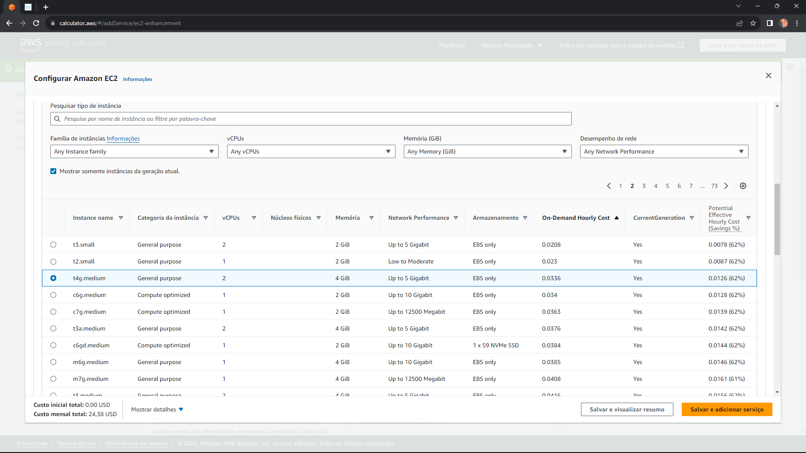

# Análise de Custo 

A análise de custos é uma etapa crucial no planejamento e execução de projetos de Big Data, uma vez que o dimensionamento inadequado ou a escolha inadequada de serviços podem resultar em custos elevados e impactar a viabilidade financeira do projeto. Para facilitar esse processo, a AWS disponibiliza a AWS Pricing Calculator, uma ferramenta que permite estimar os custos associados aos serviços e recursos utilizados em um projeto específico.

# Primeiros Passos

**Passo 1: Acesse a AWS Calculator**

Abra o site da AWS Calculator em [https://calculator.aws/#/](https://calculator.aws/#/).


**Passo 2: Crie uma Estimativa**

Clique em "Criar estimativa" para iniciar o processo de análise de custo.


**Passo 3: Pesquise Todos os Serviços**

Em "Serviços da AWS (146)", clique na caixa de seleção e troque para "pesquisar todos os serviços". Isso permitirá que você encontre e adicione os serviços específicos necessários para o projeto.


# Configurando serviços

## Amazon API Gateway

O primeiro passo na análise de custos é adicionar o serviço "Amazon API Gateway". Siga os passos abaixo:

**Passo 1: Pesquisar e Configurar o Amazon API Gateway**

Na barra de pesquisa, digite "Amazon API Gateway" e clique em "configurar".


**Passo 2: Configurações Regionais e API REST**

Na nova janela, selecione a região desejada, por exemplo, "leste dos EUA (N. da Virgínia)". Para este exemplo, deixaremos os valores relacionados às APIs HTTP zerados. Desça até a seção "API REST".


No campo "Unidades de solicitação da API REST", defina como "Número exato" e insira 8 solicitações mensais (2 por semana). O campo "Tamanho da memória do cache (GB)" é opcional e pode ser deixado em branco por enquanto. Desça até a seção da API WebSocket.


**Passo 3: Configuração da API WebSocket**

Como não utilizaremos a API WebSocket neste projeto, preencha todos os campos numéricos com zero.


Clique em "Salvar e adicionar serviço" para concluir a adição do Amazon API Gateway com as configurações especificadas.


Agora, você adicionou com sucesso o Amazon API Gateway à sua estimativa de custos na AWS Calculator.


## Amazon Simple Storage Service (S3)

O segundo passo na análise de custos é adicionar o serviço "Amazon Simple Storage Service (S3)". Siga os passos abaixo:

**Passo 1: Pesquisar e Configurar o Amazon S3**

Na barra de pesquisa, digite "Amazon Simple Storage Service (S3)" e clique em "configurar".


**Passo 2: Seleção da Classe de Armazenamento**

Escolha a região desejada, por exemplo, "leste dos EUA (N. da Virgínia)". No campo "Selecionar classes de armazenamento no S3 e outros recursos", avalie as opções disponíveis:

1. **S3 Standard:** Padrão para armazenamento de dados na nuvem. Oferece alta durabilidade, disponibilidade e desempenho, sendo adequado para dados frequentemente acessados.

2. **S3 Intelligent - Tiering:** Automatiza a movimentação de dados entre camadas de armazenamento com base em padrões de acesso. Os dados mais frequentemente acessados ficam em camadas mais rápidas, enquanto os menos acessados vão para camadas mais econômicas.

3. **S3 Standard - Infrequent Access:** Semelhante ao S3 Standard, mas projetado para dados que são acessados com menos frequência. Oferece custos mais baixos de armazenamento, mas com taxas um pouco mais altas para acesso aos dados.

4. **S3 One Zone - Infrequent Access:** Armazena dados em uma única zona de disponibilidade, tornando-o mais econômico. No entanto, não oferece a mesma durabilidade que o S3 Standard, pois está em uma única localização.

5. **S3 Glacier Flexible Retrieval:** Parte do serviço Glacier, permite recuperar dados de maneira flexível, adaptando a velocidade de recuperação aos requisitos específicos.

6. **S3 Glacier Deep Archive:** Também parte do serviço Glacier, é a opção mais econômica, mas projetada para dados que são acessados muito raramente.

7. **S3 Management and Insights:** Fornece ferramentas para gerenciar e entender melhor o uso e os custos de armazenamento no Amazon S3.

8. **S3 Object Lambda:** Executa código personalizado em resposta a solicitações de leitura de objetos no Amazon S3, possibilitando manipulação dinâmica durante a recuperação.

9. **S3 Glacier Instant Retrieval:** Uma opção do Glacier que permite recuperar dados quase instantaneamente, adequada para situações em que a rapidez na recuperação é crítica.

10. **Data Transfer:** Refere-se à transferência de dados para dentro e para fora do Amazon S3, que pode envolver custos adicionais dependendo da quantidade de dados transferidos.

Para este projeto, escolheremos "S3 Standard" devido ao acesso frequente aos dados. 


**Passo 3: Configuração do S3 Standard Recurso**

Abra o toggle do serviço "S3 Standard recurso" e preencha os dados:

- "Armazenamento S3 Standard": 20 GB por mês.
- "A quantidade especificada de dados já está armazenada no S3 Standard".
- "Solicitações PUT, COPY, POST, LIST para S3 Standard": 50 solicitações.
- "GET, SELECT e todas as outras solicitações do S3 Standard": 40 solicitações.

Os campos "Dados retornados pelo S3 Select" e "Dados verificados pelo S3 Select" podem ser deixados em branco por enquanto, já que ainda não temos previsão específica para essas solicitações.


Clique em "Salvar e adicionar serviço" para concluir a adição do Amazon S3 com as configurações especificadas.


Agora, você adicionou com sucesso o Amazon S3 à sua estimativa de custos na AWS Calculator.

## Amazon Redshift

O terceiro passo na análise de custos é adicionar o serviço "Amazon Redshift". Siga os passos abaixo:

**Passo 1: Pesquisar e Configurar o Amazon Redshift**

Na barra de pesquisa, digite "Amazon Redshift" e clique em "configurar".


**Passo 2: Configurações Regionais e Escolha da Modalidade "Redshift sem servidor"**

Na nova janela, selecione a região desejada, por exemplo, "leste dos EUA (N. da Virgínia)". Escolha a opção "Redshift sem servidor".

**Passo 3: Escolha do Tamanho da Workload**

Avalie e escolha o tamanho da workload com base nas características abaixo:

- **Pequeno:** Volume de dados relativamente baixo, consultas simples, poucos usuários simultâneos, baixa demanda computacional.

- **Médio:** Volume de dados moderado, consultas mais complexas, número moderado de usuários simultâneos, maior demanda computacional.

- **Grande:** Grandes volumes de dados, consultas altamente complexas, muitos usuários simultâneos, requer capacidade computacional substancial.

Para este exemplo, escolheremos "Pequeno", pois o volume de dados é baixo.

**Passo 4: Escolha da RPU Base**

A RPU (Redshift Processing Unit) é uma unidade de medida que representa a capacidade de processamento. Escolha a RPU Base de acordo com a capacidade necessária. Para 15GB, selecionaremos a RPU Base de 16.

**Passo 5: Definição do Tempo de Execução Diário Esperado**

Informe o tempo de execução diário esperado, considerando a jornada de trabalho. Para este exemplo, consideraremos 3 horas diárias.

Clique em "Salvar e adicionar serviço" para concluir a adição do Amazon Redshift com as configurações especificadas.


Agora, você adicionou com sucesso o Amazon Redshift à sua estimativa de custos na AWS Calculator.

## AWS Lambda

O quarto passo na análise de custos é adicionar o serviço "AWS Lambda". Siga os passos abaixo:

**Passo 1: Pesquisar e Configurar o AWS Lambda**

Na barra de pesquisa, digite "AWS Lambda" e clique em "configurar".


**Passo 2: Configurações Regionais**

Na nova janela, escolha a região desejada, por exemplo, "leste dos EUA (N. da Virgínia)".

**Passo 3: Utilização do Nível Gratuito**

Para este exemplo, utilizaremos o nível gratuito que oferece 1 milhão de solicitações gratuitas por mês e 400.000 GB/segundo de tempo de computação por mês. Este serviço será utilizado para extrair ou excluir dados da API do cliente.


**Passo 4: Preenchimento dos Campos**

- **Arquitetura:** x86
- **Número de Solicitações:** 10.000
- **Duração de Cada Solicitação (em ms):** 3.000
- **Quantidade de Memória Alocada:** 5
- **Quantidade de Armazenamento Temporário Alocada:** 5


Clique em "Salvar e adicionar serviço" para concluir a adição do AWS Lambda com as configurações especificadas.


Agora, você adicionou com sucesso o AWS Lambda à sua estimativa de custos na AWS Calculator.

## Amazon EventBridge

O quinto passo na análise de custos é adicionar o serviço "Amazon EventBridge". Siga os passos abaixo:

**Passo 1: Pesquisar e Configurar o Amazon EventBridge**

Na barra de pesquisa, digite "Amazon EventBridge" e clique em "configurar".


**Passo 2: Configurações Regionais**

Na nova janela, escolha a região desejada, por exemplo, "leste dos EUA (N. da Virgínia)".

**Passo 3: Preenchimento dos Campos**

1. **Tamanho da Carga Útil (Payload): 800 KB:**
   - Refere-se ao tamanho máximo permitido para os dados incluídos em um evento. Neste caso, é limitado a 800 kilobytes.

2. **Número de Eventos Personalizados: 8 por Mês:**
   - Indica a quantidade de eventos que você pode criar e enviar de forma personalizada para o EventBridge em um período de um mês. Neste caso, você pode enviar até 8 eventos personalizados por mês.

3. **Número de Eventos de Parceiros: 8 por Mês:**
   - Representa a quantidade de eventos provenientes de parceiros ou serviços integrados ao EventBridge que você pode receber em um período de um mês. Limite de 8 eventos de parceiros por mês.

4. **Número de Eventos entre Regiões: 0 por Mês:**
   - Indica o número de eventos que podem ser enviados entre regiões. Neste caso, o limite é zero, o que significa que não há eventos permitidos entre diferentes regiões do AWS.

5. **Número Faturável entre Barramentos nos Eventos da Mesma Conta (Mensal): 0 por Mês:**
   - Refere-se à quantidade de eventos que podem ser faturados entre barramentos do EventBridge na mesma conta AWS. Neste caso, o limite é zero, indicando que não há eventos faturáveis entre esses barramentos.


6. **Número de Invocações: 20 por Mês:**
   - Indica a quantidade de vezes que um target (como uma função Lambda) pode ser invocado em resposta a eventos no EventBridge. Limite de 20 invocações por mês.

7. **Número de Eventos: 22 por Mês:**
   - Representa a quantidade total de eventos (soma de eventos personalizados, eventos de parceiros, etc.) que você pode gerenciar no EventBridge em um período de um mês. Neste caso, o limite é de 22 eventos por mês.

8. **Número de Eventos Reproduzidos: 22 por Mês:**
   - Indica quantos eventos você pode reproduzir (reenviar) no EventBridge em um período de um mês. Limite de 22 eventos reproduzidos por mês.


Clique em "Salvar e adicionar serviço" para concluir a adição do Amazon EventBridge com as configurações especificadas.


Agora, você adicionou com sucesso o Amazon EventBridge à sua estimativa de custos na AWS Calculator.

## Amazon EC2

O sexto e último passo na análise de custos é adicionar o serviço "Amazon EC2". Siga os passos abaixo:

**Passo 1: Pesquisar e Configurar o Amazon EC2**

Na barra de pesquisa, digite "Amazon EC2" e clique em "configurar".


**Passo 2: Configurações Regionais**

Na nova janela, escolha a região desejada, por exemplo, "leste dos EUA (N. da Virgínia)".

**Passo 3: Preenchimento dos Campos**

1. **Locação: Instâncias Compartilhadas:**
   - Refere-se ao fato de as instâncias estarem sendo executadas em hardware físico compartilhado com outras instâncias na mesma máquina física.

2. **Sistema Operacional: Linux:**
   - Indica que as instâncias estão utilizando o sistema operacional Linux.

3. **Carga de Trabalho: Consistente, Número de Instâncias: 2:**
   - Descreve a natureza consistente da carga de trabalho e especifica que há duas instâncias em execução.


4. **Instância do EC2 Avançada: t4g.medium: Memória 4 GB:**
   - Essa instância pertence à família t4g, que é uma família de instâncias baseadas em ARM (Amazon EC2 Graviton2). As instâncias Graviton2 são projetadas pela AWS e são baseadas na arquitetura ARM, oferecendo desempenho eficiente e otimizado para cargas de trabalho variadas. Para processar os dados são necessários minimamente 4GB.


  
5. **Estratégia de Preços: Utilização On-Demand: 100% Utilizado/Mês:**
   - Refere-se à estratégia de preços, indicando que as instâncias estão sendo pagas sob demanda e estão 100% utilizadas durante todo o mês.


Clique em "Salvar e adicionar serviço" para concluir a adição do Amazon EC2 com as configurações especificadas.


Agora, você adicionou com sucesso o Amazon EC2 à sua estimativa de custos na AWS Calculator.

# Visualizar 

Para visualizar o resumo da estimativa, clique em "Visualizar resumo".


Para personalizar os serviços, adicione uma descrição específica para cada serviço. Clique no ícone de edição (pincel) e insira as seguintes frases para cada serviço:

1. **Amazon API Gateway:**
   - Utilizada para manipulação da API do parceiro (GET).

2. **Amazon Simple Storage Service (S3):**
   - Utilizado para armazenamento dos dados em CSV (Data Lake).

3. **Amazon Redshift:**
   - Utilizado para o carregamento dos dados e criação das views (Data Warehouse).

4. **AWS Lambda:**
   - Utilizada para funções que auxiliam na manipulação da API do parceiro.

5. **Amazon EventBridge:**
   - Utilizado para atualizar a API do parceiro semanalmente.

6. **Amazon EC2:**
   - Utilizado para manter o Metabase conectado (Infográfico/Dashboard).
  


Para visualizar o PDF criado pela AWS com a estimativa, <a href="./Data Dream Estimate - Calculadora de Preços da AWS.pdf">clique aqui</a> ou acesse pelo link [https://calculator.aws/#/estimate?id=7abe99dcf55e7651f5043ce260426121bf193fd5 ](https://calculator.aws/#/estimate?id=7abe99dcf55e7651f5043ce260426121bf193fd5 ).

# Comparação - AWS X Azure

Pensando na eventualidade de o cliente desejar migrar os dados do pipeline de big data para a Azure, estimamos os custos relacionados à infraestrutura na Azure, considerando a mesma quantidade de dados (15GB), serviços e configurações utilizados atualmente na AWS.

**Observação:** Utilizamos o Pricing Calculator da Azure para realizar a estimativa, seguindo os mesmos passos da AWS. Abaixo apresenta-se a estimativa gerada.

Para visualizar o PDF criado pela Azure com a estimativa, <a href="./ExportedEstimateAzure.pdf">clique aqui</a> ou acesse pelo link [https://azure.com/e/84215a92bd334ddc85d8037607144494](https://azure.com/e/84215a92bd334ddc85d8037607144494).

# Custos - Time de desenvolvimento

O projeto em questão tem uma duração estimada de 10 semanas, envolvendo a colaboração de uma equipe composta por 6 desenvolvedores. Para a realização dessa estimativa salarial, consideramos a média salarial de desenvolvedores juniores nos Estados Unidos, que é de $5,942.00 por mês, de acordo com informações obtidas no [Glassdoor](https://www.glassdoor.com.br/Salaries/united-states-junior-developer-salary-SRCH_IL.0,13_IN1_KO14,30.htm#:~:text=A%20m%C3%A9dia%20salarial%20de%20Junior,%24%204.456%20e%20US%24%208.319.). 

A seguir, apresenta-se uma tabela sumarizando os principais dados do projeto:

| Item                        | Descrição                                           | Valor        |
|-----------------------------|-----------------------------------------------------|--------------|
| Duração do Projeto           | 10 Semanas                                          | -            |
| Número de Desenvolvedores    | 6 Pessoas                                           | -            |
| Salário mensal dev júnior ($) | Média                                               | $5,942.00    |
| Horas trabalhadas totais     | -                                                   | 162          |
| Remuneração por hora         | 2 meses de salário / Quant. Horas trabalhadas      | $73.36     |

Fonte da média salarial: [Glassdoor](https://www.glassdoor.com.br/Salaries/united-states-junior-developer-salary-SRCH_IL.0,13_IN1_KO14,30.htm#:~:text=A%20m%C3%A9dia%20salarial%20de%20Junior,%24%204.456%20e%20US%24%208.319.)

Dólar (taxa de câmbio): $1 = 4.92
                                     

# Cálculo do Custo Total do Projeto com AWS

## 1. Custo total dos salários dos desenvolvedores:

- Salário mensal de um desenvolvedor júnior: $5,942.00
- Número de desenvolvedores: 6
- Duração do projeto: 10 semanas (considerando 4 semanas por mês)

```plaintext
Custo total dos salários = $5,942.00 * 6 * 10/4 = $89,130.00
```

## 2. Custo total da infraestrutura:

Custo mensal da infraestrutura: $598.52

```plaintext
Custo total da infraestrutura = $598.52 * 10/4 = $1,496.30
```

## Custo total do projeto:

Soma do custo total dos salários e do custo total da infraestrutura.

```plaintext
Custo total do projeto = $89,130.00 + $1,496.30 = $90,626.30
```

# Cálculo do Custo Total do Projeto com Azure

## 1. Custo total dos salários dos desenvolvedores:

- Salário mensal de um desenvolvedor júnior: $5,942.00
- Número de desenvolvedores: 6
- Duração do projeto: 10 semanas (considerando 4 semanas por mês)

```plaintext
Custo total dos salários = $5,942.00 * 6 * 10/4 = $89,130.00
```

## 2. Custo total da infraestrutura:

Custo mensal da infraestrutura: $530.53

```plaintext
Custo total da infraestrutura = $530.53 * 10/4 = $1,326.32
```

## Custo total do projeto:

Soma do custo total dos salários e do custo total da infraestrutura.

```plaintext
Custo total do projeto = $89,130.00 + $1,326.32 = $90,456.32
```