## Sumário

[1. Introdução](#c1)

[2. Consulta e atualização automática](#c2)

[3. Exclusão automatizada dos dados](#c3) 

<br>

# <a name="c1"></a>1. Introdução

Esta seção do documento delineia uma abordagem abrangente para a gestão automatizada de dados, explorando o uso de tecnologias avançadas como Amazon EventBridge e AWS Lambda. Através de um processo detalhadamente descrito, ilustramos como a atualização e exclusão automatizadas de dados podem ser eficientemente implementadas para assegurar a relevância e segurança das informações. Além disso, apresentamos códigos específicos e simulações de funcionamento, fornecendo uma visão prática de como essas tecnologias podem ser aplicadas no gerenciamento de dados.


# <a name="c2"></a>2. Consulta e atualização automática

A integração eficiente e segura de dados é um aspecto crucial no gerenciamento de informações provenientes de APIs de parceiros. Neste contexto, a atualização automática de dados desempenha um papel vital, assegurando que as informações estejam sempre atualizadas e disponíveis para consulta e análise. Para atingir este objetivo, implementamos um processo automatizado utilizando as capacidades avançadas do Amazon EventBridge e AWS Lambda. Este processo não só simplifica a gestão de dados, mas também aumenta a confiabilidade e a eficiência do sistema.

### 2.1 Criação da Função Lambda
**Acesso ao AWS Lambda:**

1. Acesse AWS Console.


2. No menu "Serviços", selecione "Lambda".


**Configuração dos Detalhes da Função:**

1. Clique em "Criar função".


2. Defina um nome para a função.

3. Escolha a runtime desejada (por exemplo, Node.js, Python).

**Revisão e Criação da Função:**

1. Revise todas as configurações.
2. Clique em "Criar função" para finalizar a criação da função Lambda.


### 2.2 Configuração do Amazon EventBridge
**Acesso ao Amazon EventBridge:**

1. No Amazon EventBridge, clique em "Programação do EventBridge" e, em seguida, "Criar programação".


**Especificação de Detalhes do Cronograma:**

1. Nome do cronograma: atualizacao-dados-api-bucket.
2. Descrição: Atualizar dados da api do cliente nos buckets S3 AWS.


3. Ocorrência: Escolha "cronograma recorrente".
4. Tipo de Cronograma: Selecione "cronograma baseado em cron".
5. Expressão Cron: Configure para (0 minutos, 00 horas * dia do mês, * mês, ? dia da semana, * ano).
6. Janela de Tempo Flexível: Defina como "Desligado".
7. Período de Tempo: Deixe em branco.


### 2.3 Detalhes do Destino
**Seleção do Destino:**

1. Escolha "destinos modelados".
2. Selecione "AWS Lambda Invoke".


**Configuração do Invoke:**

1. Selecione a função Lambda criada: atualização-dados-api.
2. Clique em "Próximo".


**Ação Após a Conclusão do Agendamento:**

1. Selecione a opção "NONE".


**Finalização do Cronograma:**

1. Nome do perfil: Atualizacao-Dados-API-Cliente.


2. Clique em "Criar cronograma".


3. Ao finalizar com êxito esta etapa, é exibida a notificação "Cronograma Criado". 


### 2.4 Configuração da Função Lambda atualizacao-dados-api
O código da função Lambda é responsável por processar e salvar os dados atualizados. Abaixo, disponibilizamos o código implementado:

```python
import csv
from datetime import datetime, timedelta
import boto3

def save_to_csv(data, file_name):
    if not data:
        return

    fieldnames = list(data[0].keys())
    with open('/tmp/' + file_name, 'w', newline='', encoding='utf-8') as csvfile:
        writer = csv.DictWriter(csvfile, fieldnames=fieldnames)
        writer.writeheader()
        for row in data:
            writer.writerow(row)

def upload_to_aws(local_file, bucket, s3_file):
    s3 = boto3.client('s3')
    try:
        s3.upload_file(local_file, bucket, s3_file)
        return True
    except FileNotFoundError:
        return False
    except Exception as e:
        print(f"Erro ao enviar arquivo para o S3: {e}")
        return False

def process_and_save(table_name, date, csv_file_path, s3_bucket):
    s3 = boto3.client('s3')
    bucket = s3_bucket
    key = f"{table_name}/{date}.csv"

    try:
        data = s3.get_object_content(Bucket=bucket, Key=key)
        data = data.decode('utf-8')
        data = csv.DictReader(data.splitlines(), delimiter=',')
        save_to_csv(data, csv_file_path)
        print(f'Dados de {table_name} processados e salvos.')
    except Exception as e:
        print(f"Erro ao processar dados de {table_name}: {e}")

def lambda_handler(event, context):
    sale_date = (datetime.now() - timedelta(days=1)).strftime('%Y-%m-%d')

    categories = ['category', 'establishment', 'sale']
    s3_bucket = 'apiparceiro'

    for category in categories:
        csv_file_path = f'dados_{category}.csv'
        process_and_save(category, date=sale_date, csv_file_path=csv_file_path, s3_bucket=s3_bucket)

    return 'Dados processados e salvos com sucesso.'
```
## 2.5 Teste da Função Lambda

1. **Configuração do Evento de Teste:**
   - Na função Lambda, clique em "Test".
   - Nome do evento de teste: `atualizacao-dados-api`.
   - Compartilhamento: Defina como "Privado".
   - JSON do evento: `{}`.

2. **Execução do Teste:**
   - Clique em "Criar Teste" e execute o teste para validar o funcionamento da função.


## 2.6 Resultados Esperados

Após a execução bem-sucedida do teste, os dados da API do parceiro são processados e salvos automaticamente no S3, conforme configurado na função Lambda. Este processo garante a atualização contínua e automática dos dados.


# <a name="c3"></a>3. Exclusão automatizada dos dados

Dado que as informações provenientes da API do parceiro são confidenciais, não é apropriado mantê-las em buckets públicos por períodos prolongados. Portanto, implementou-se uma exclusão automatizada desses dados.

Por motivos de segurança, a exclusão requer a apresentação, em formato JSON, do nome do bucket e da senha cadastrada para exclusão. Isso devido ao acesso concedido a vários colaboradores e à variação nos períodos de retenção dos dados, dependendo do projeto em questão. A seguir, exibe-se o processo de automação da exclusão, incluindo os códigos pertinentes e uma simulação do seu funcionamento.

## 3.1 Criação da AWS Lambda

1. **Acesse o Console da AWS:**
   Faça login na sua conta AWS e acesse o Console da AWS em [https://aws.amazon.com/](https://aws.amazon.com/).

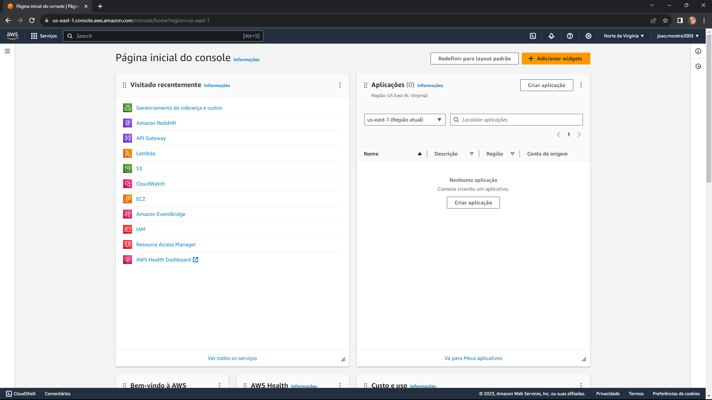

1. **Navegue até o AWS Lambda:**
   No Console da AWS, vá para o serviço "Lambda" localizado no menu "Serviços".

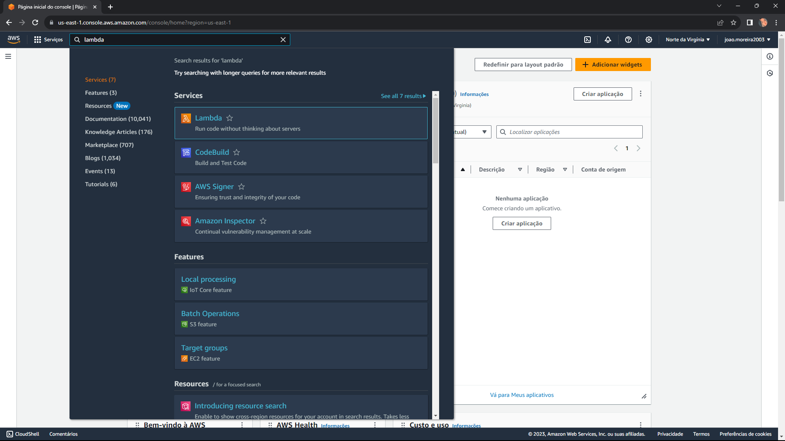

2. **Crie uma Nova Função Lambda:**
   - Clique em "Funções" no painel de navegação à esquerda.
   - Em seguida, clique no botão "Criar função".

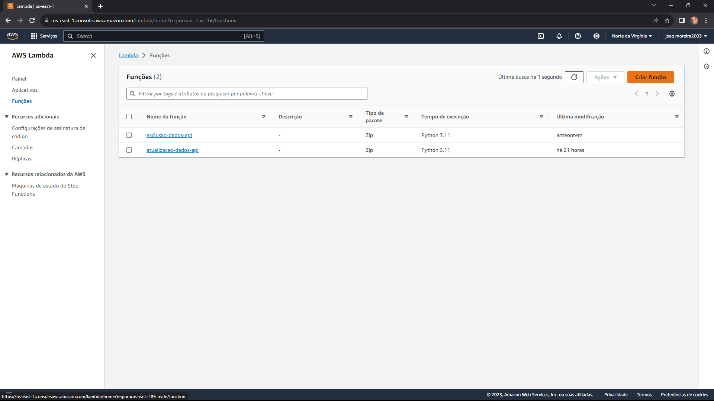

3. **Configure os Detalhes da Função:**
   - Dê um nome para a função.
   - Escolha uma runtime, como Node.js, Python, etc.

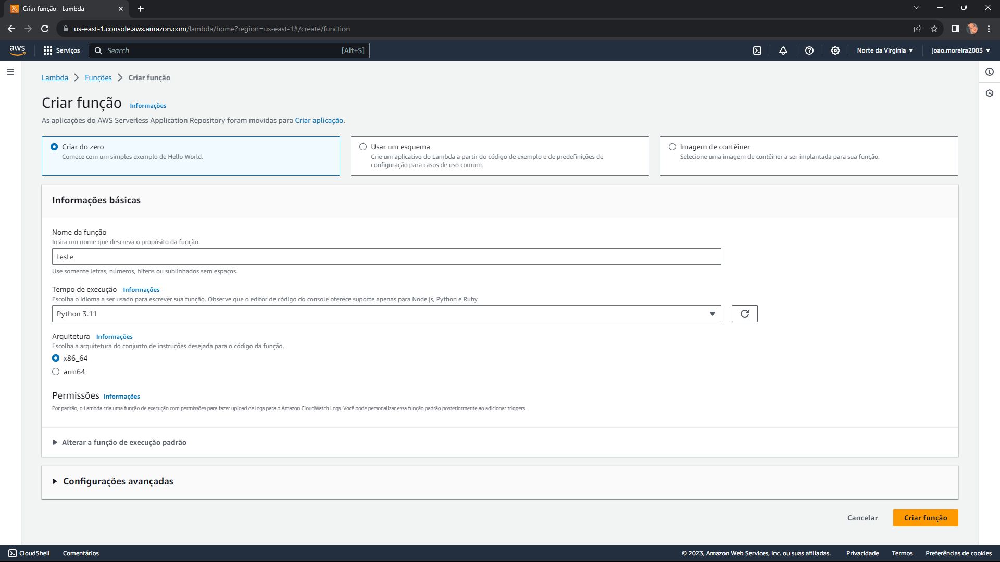
  
4.  **Reveja e Crie:**
    - Revise todas as configurações e clique em "Criar função" para criar sua função Lambda.

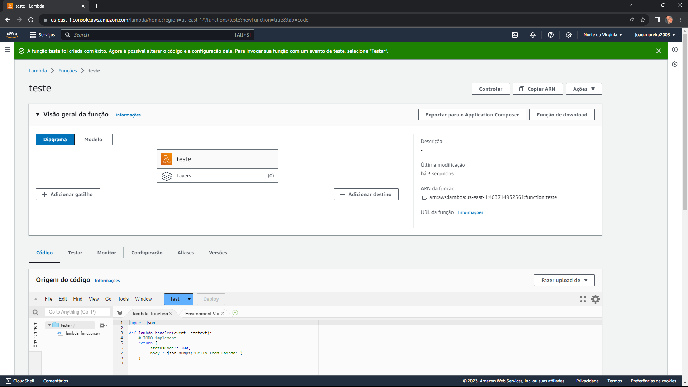

## 3.2 Adição do gatilho "API Gateway"

1. **Selecione sua Função Lambda:**
    Encontre e selecione a função Lambda à qual deseja adicionar o gatilho API Gateway.

2. **Adicione um Gatilho:**
   - No tópico "Visão geral da função", clique em "Adicionar Gatilho",
   - Escolha "API Gateway" como o tipo de gatilho;

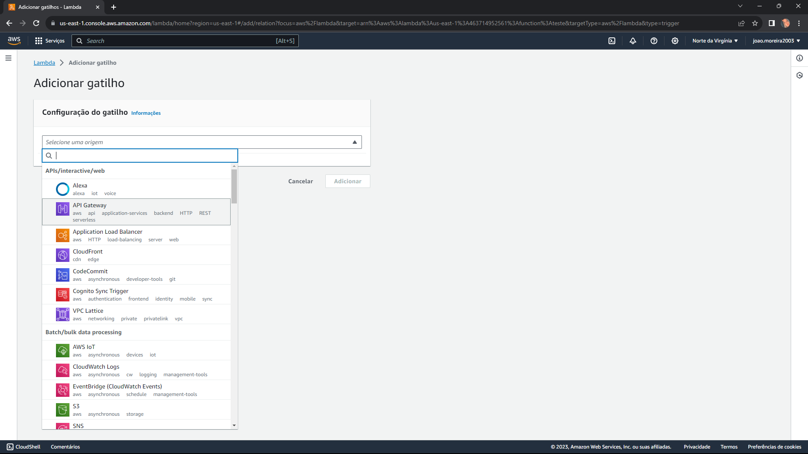

3. **Configure o Gatilho API Gateway:**

    - Escolha a opção "Criar uma nova API" ou selecione uma API Gateway existente,
    - Escolha "REST API",
    - Configure a segurança conforme necessário,
    - Clique em "Adicionar";

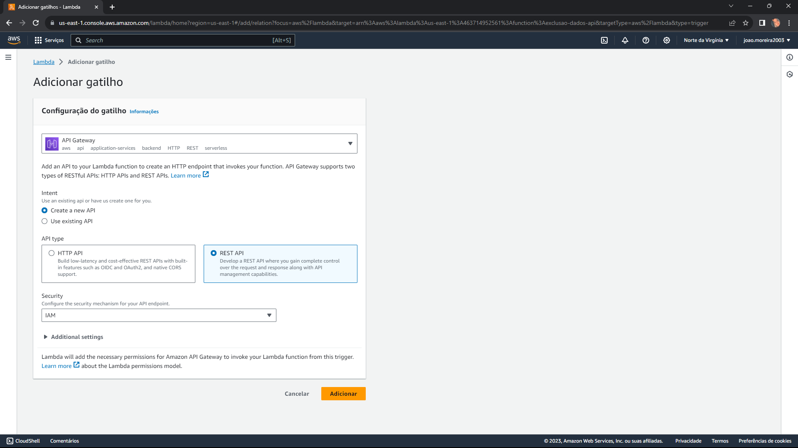

1. **Salve as Configurações:**
    Certifique-se de salvar as configurações da função Lambda após adicionar o gatilho.

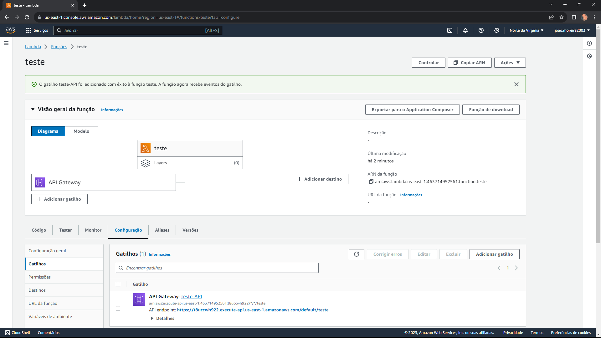

2. **Criação do método:**
   - Clique no bloco "API Gateway" criado,
   - Na guia "Configuração", clique na url com o nome da api criada,
   - Na nova janela que abrir, clique no botão "Ações",
   - Selecione "Criar método";

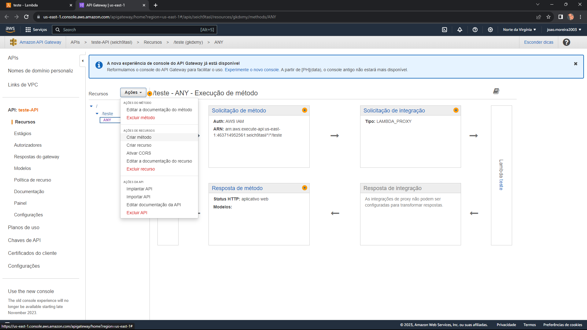

3. **Configuração do método:**
    - Selecione o método "POST",
    - Clique no icone "✔" para confirmar a criação,
    - No tópico "Tipo de integração" selecione "Função Lambda",
    - Abra outra guia na página inicial da sua função lambda, e copie a "ARN da função",
    - No tópico "Função Lambda" cole o "ARN da função" copiado,
    - Clique no botão "Salvar";

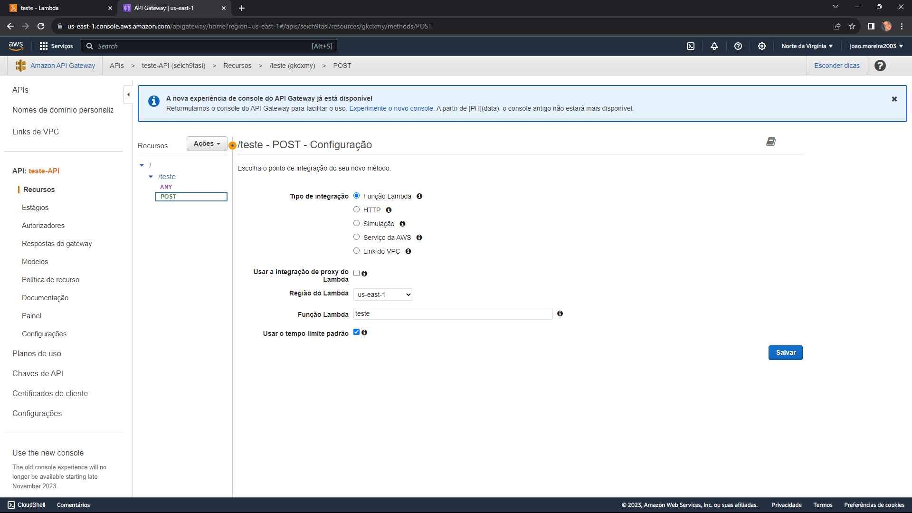

## 3.3 Criação do "Estágio"

1. **Crie um Estágio:**
    - Encontre e selecione a API à qual deseja adicionar um estágio,
    - No menu lateral, clique em "Estágios",
    - Clique no botão "Criar",
    - Dê um nome ao seu estágio,
    - Adicione uma "Descrição do estágio",
    - Selecione uma "Implantação" para associar ao estágio,
    - Clique em "Criar";

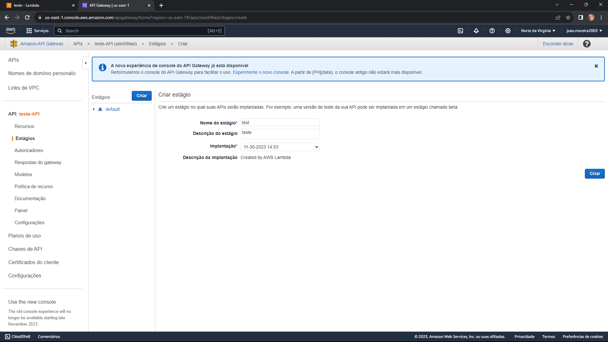
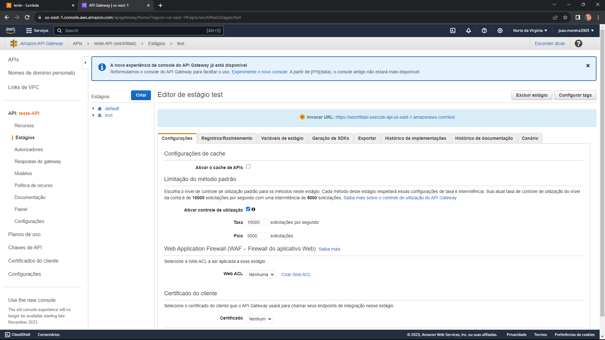

2. **Implante as Mudanças:**
    - Retorne a aba "Recursos" e clique no método que está sendo utilizado,
    - Clique em "Ações" e escolha "Implantar API".
    - Escolha o "Estágio de implantação" desejado e clique em "Implante".
    - 
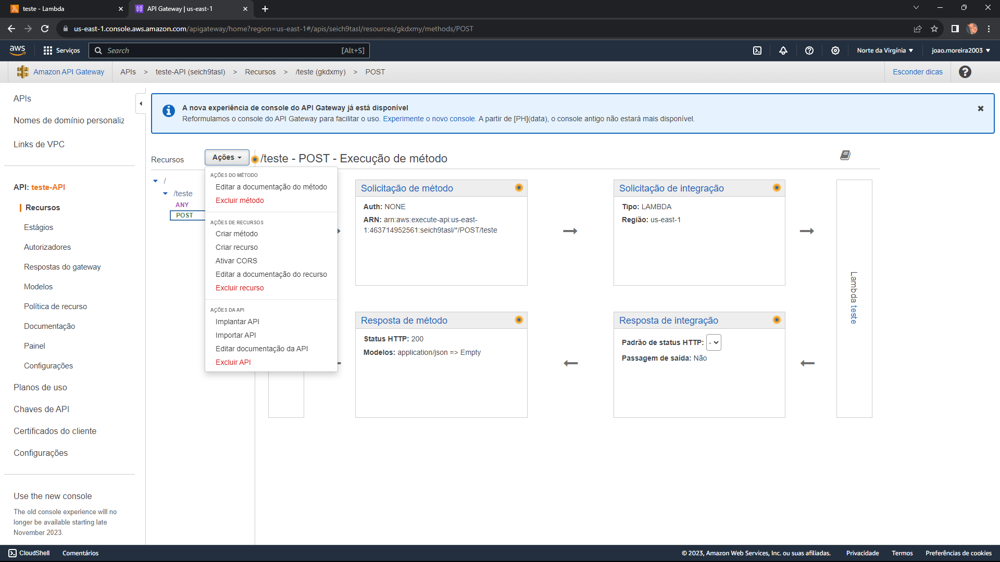
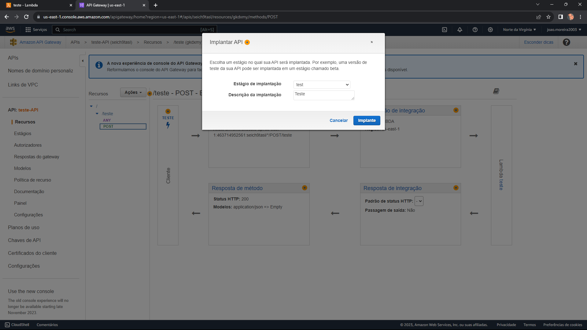

3. **Obtenha a URL do Estágio:**
    - Na página de detalhes da API, clique na URL do estágio criado.
    - Essa URL agora representa o endpoint da sua API no estágio especificado.


## 3.4 Código "lambda_function.py"

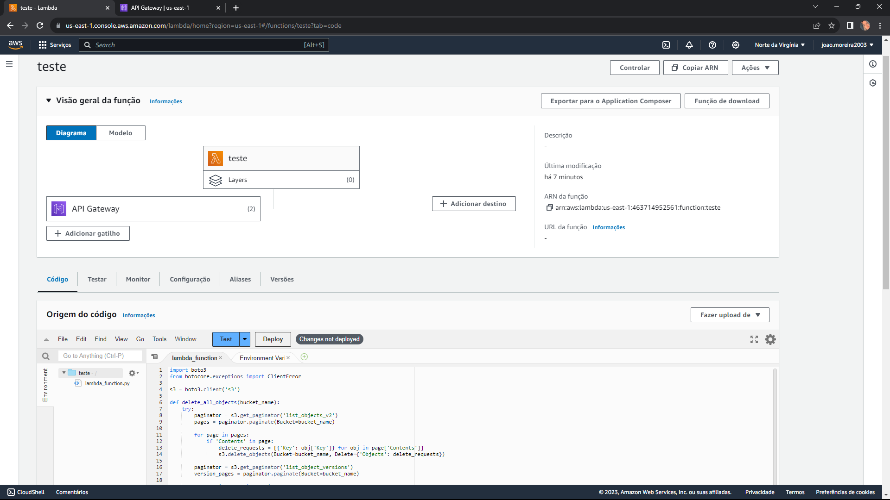

1. **Importação de Bibliotecas:**

- **import boto3:** Importa a biblioteca boto3, que fornece uma API para interagir com os serviços da AWS S3.
- **from botocore.exceptions import ClientError:** Importa a exceção ClientError do botocore, que pode ser usada para lidar com erros específicos do cliente.
  
2. **Inicialização do Cliente S3:**

- s3 = boto3.client('s3'): Inicializa um cliente S3 usando boto3.

3. **Definição da Função delete_all_objects:**
 - Aceita o nome de um bucket como parâmetro.
  - Utiliza paginação para listar e excluir todos os objetos dentro do bucket.
  - Verifica se o bucket é versionado e, se sim, remove todas as versões dos objetos.

4. **Definição da Função lambda_handler:**
 - Trata os eventos recebidos pela função Lambda.
  - Extrai o nome do bucket e a senha do evento.
  - Verifica se a senha fornecida corresponde à senha esperada.
     - Se a senha for correta, chama a função delete_all_objects para excluir todos os objetos no bucket.
  - Retorna códigos de status HTTP apropriados e mensagens de resposta.

5. **Chamada da Função delete_all_objects:**
 - Dentro da função lambda_handler, chama a função delete_all_objects com o nome do bucket extraído do evento.
    - Se a exclusão for bem-sucedida, retorna um código de status 200 e uma mensagem de sucesso.
    - Se houver um erro na exclusão, retorna um código de status 500 e a mensagem de erro.

6. **Verificação da Senha:**
- Antes de realizar a exclusão, verifica se a senha fornecida no evento é igual a 'senhacadastrada'.
  - Se a senha não coincidir, retorna um código de status 401 (Não autorizado).

```PYTHON
import boto3
from botocore.exceptions import ClientError

s3 = boto3.client('s3')

def delete_all_objects(bucket_name):
    try:
        paginator = s3.get_paginator('list_objects_v2')
        pages = paginator.paginate(Bucket=bucket_name)

        for page in pages:
            if 'Contents' in page:
                delete_requests = [{'Key': obj['Key']} for obj in page['Contents']]
                s3.delete_objects(Bucket=bucket_name, Delete={'Objects': delete_requests})

        paginator = s3.get_paginator('list_object_versions')
        version_pages = paginator.paginate(Bucket=bucket_name)

        for version_page in version_pages:
            delete_requests = []
            if 'Versions' in version_page:
                delete_requests.extend([{'Key': v['Key'], 'VersionId': v['VersionId']} for v in version_page['Versions']])
            if 'DeleteMarkers' in version_page:
                delete_requests.extend([{'Key': v['Key'], 'VersionId': v['VersionId']} for v in version_page['DeleteMarkers']])
            if delete_requests:
                s3.delete_objects(Bucket=bucket_name, Delete={'Objects': delete_requests})

    except ClientError as e:
        return False, e.response['Error']['Message']
    return True, "Objects deleted"
    
def lambda_handler(event, context):
    bucket_name = event['bucket_name']
    password = event['password']

    if password == ' ': # Adicione a senha desejada
    
        objects_deleted, message = delete_all_objects(bucket_name)
        if not objects_deleted:
            return {
                'statusCode': 500,
                'body': message
            }
        return {
            'statusCode': 200,
            'body': "All objects in bucket '{}' deleted successfully".format(bucket_name)
        }
    else:
        return {
            'statusCode': 401,
            'body': "Unauthorized"
        }
```

## 3.5 Resultados esperados

O formato do JSON esperado pelo endpoint no BODY é: 

```JSON
{
    "bucket_name": "nomeBucket",
    "password": "senhaCadastrada"
}
```


