## Sumário

[1. Introdução](#c1)

[2. Metabase Instalação e Configuração](#c2)

[3. Pontos fortes e fracos](#c3)

[4. Descrição dos dados](#c4)

[5. Pontos de melhoria](#c5)

[6. Testes](#c6)

[7. Referências](#c7)

<br>

# <a name="c1"></a>1. Introdução

O projeto visa atender as necessidades da Integration, que oferece consultoria a clientes que atuam em diversas categorias nos canais alimentares (supermercados, hipermercados, atacadistas) e food service (bares, restaurantes, food trucks). O desafio apresentado é a falta de uma ferramenta que forneça informações detalhadas sobre o potencial de consumo em nível granular, considerando cidade, canal e região. Essa lacuna impede a tomada de decisões estratégicas e ações direcionadas para o desenvolvimento de categorias ou canais específicos.

O objetivo principal do infográfico é apresentar visualmente os resultados do estudo estatístico realizado no pipeline de Big Data baseado em recursos da AWS. A criação desse infográfico busca fornecer ao cliente uma representação gráfica intuitiva do potencial de consumo em cada categoria, considerando variáveis como estado e canal de atendimento.

Dessa forma, o infográfico não apenas simplifica a interpretação dos resultados, mas também capacita o cliente a tomar decisões informadas e estratégicas no dia a dia operacional. Ao transformar dados estatísticos em gráficos e figuras, o cliente terá uma visão instantânea e detalhada do cenário de consumo em diferentes localidades e canais. Isso facilitará a identificação de oportunidades de crescimento, permitindo que a equipe seja direcionada a implementar ações táticas específicas para otimizar o desempenho.


# <a name="c2"></a>2. Metabase Instalação e Configuração

Esta etapa relata o processo de instalação e configuração da plataforma Metabase, uma ferramenta de análise de dados de código aberto, com base no tutorial disponibilizado no repositório do projeto no GitHub (2023). Através deste guia, buscaremos fornecer uma visão passo a passo do procedimento, abordando os requisitos, etapas de instalação e configuração.

## 2.1. Docker

### Passo 1: Preparando o Sistema

1. Atualize o Windows: Na barra de pesquisa, digite "Windows Update" e execute a atualização do sistema.

2. Abra o CMD como Administrador: Na barra de pesquisa, digite "CMD," clique com o botão direito e selecione "Executar como administrador."

3. Ative o WSL 1: No CMD, insira o comando:
   ```CMD
   dism.exe /online /enable-feature /featurename:Microsoft-Windows-Subsystem-Linux /all /norestart
    ```

### Passo 2: Atualizando para WSL 2

1. Instale o Virtual Machine Platform (VMP): Execute o comando no CMD:
    ```CMD
    dism.exe /online /enable-feature /featurename:VirtualMachinePlatform /all /norestart
    ```

2. Reinicie o PC.
3. Abra o CMD como Administrador novamente e insira:
    ```CMD
    wsl --set-default-version 2
    ```

### Passo 3: Instalando o Docker

1. Baixe o Docker Desktop no Docker Hub:
  
   https://docs.docker.com/desktop/install/windows-install/ 

2. Depois de baixar o Docker Desktop Installer.exe
    
    Execute o seguinte comando em um terminal para instalar o Docker Desktop:
    ```CMD
    "Docker Desktop Installer.exe" install
    ```

3. Se estiver usando o prompt de comando do Windows:
   ```CMD
   start /w "" "Docker Desktop Installer.exe" install
    ```

4. Se sua conta de administrador for diferente de sua conta de usuário, você deverá adicionar o usuário ao grupo docker-users :
    ```CMD
   net localgroup docker-users <user> /add
    ```

5. O Docker Desktop não inicia automaticamente após a instalação. Pesquise Docker e selecione Docker Desktop nos resultados da pesquisa. O menu  exibe o aplicativo baixado. 


## 2.2. Executando o Metabase com Docker

**Observação:** Certifique-se de que o Docker está instalado e em execução.

1. Obtenha a imagem mais recente do Metabase:
    ```bash
    docker pull metabase/metabase:latest
    ```

2. Inicie o contêiner Metabase na porta 3000:
    ```bash
    docker run -d -p 3000:3000 --name metabase metabase/metabase
    ```

3. Opcional - Para visualizar os logs durante a inicialização, execute:
    ```bash
    docker logs -f metabase
    ```
4.  Após a inicialização, acesse sua metabase em http://localhost:3000.

Agora que o Metabase está iniciado, siga os passos abaixo para importar dados e configurar seu banco.

## 2.3. Acessando o Metabase

1. Abra seu navegador e acesse http://localhost:3000. Faça login ou crie uma conta no Metabase.

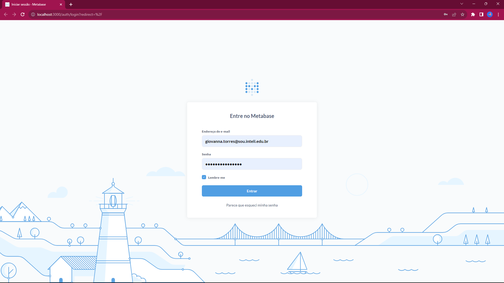

1. Após o login, você será direcionado ao menu inicial do Metabase.

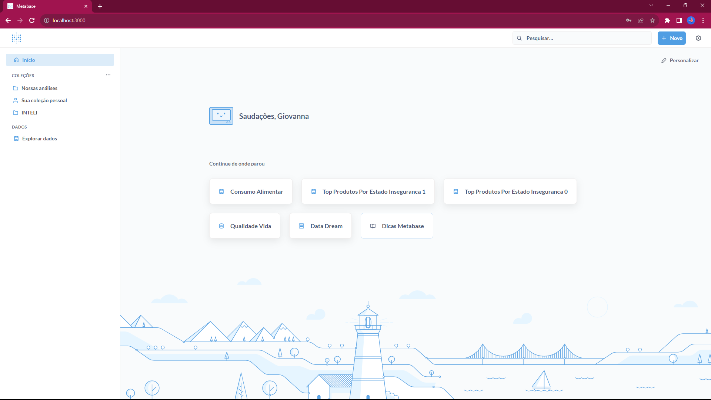

3. No menu lateral, clique em "Explorar Dados."

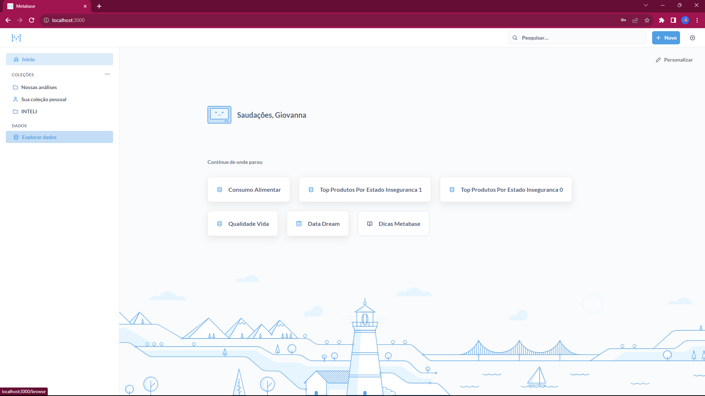

4. Na janela que se abrirá, serão exibidos os dados cadastrados na sua conta.

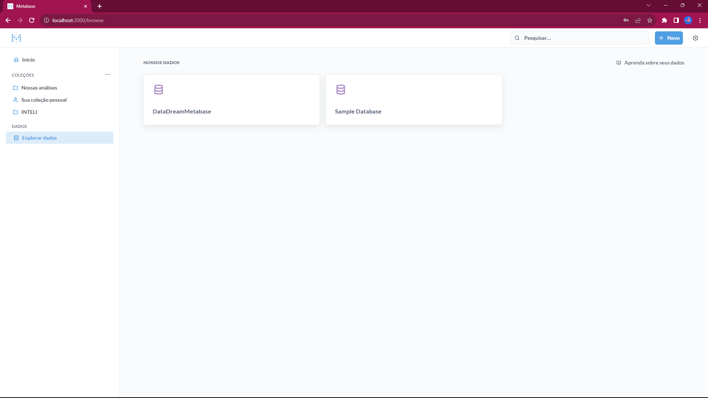

## 2.3. Configurando um Banco de Dados

1. Vamos agora configurar um banco de dados. No menu superior, clique em "Início," depois em "Configurações," e selecione "Configurações de Admin."

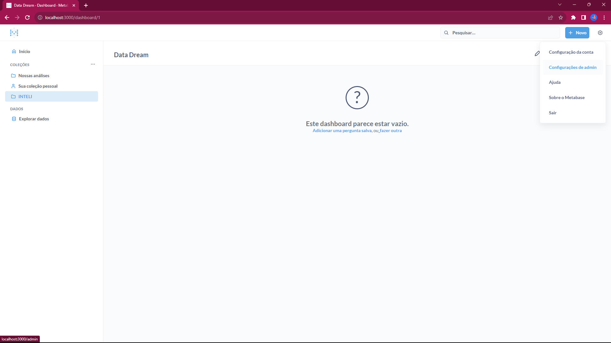

2. Na janela de configurações de admin, clique em "Banco de Dados."

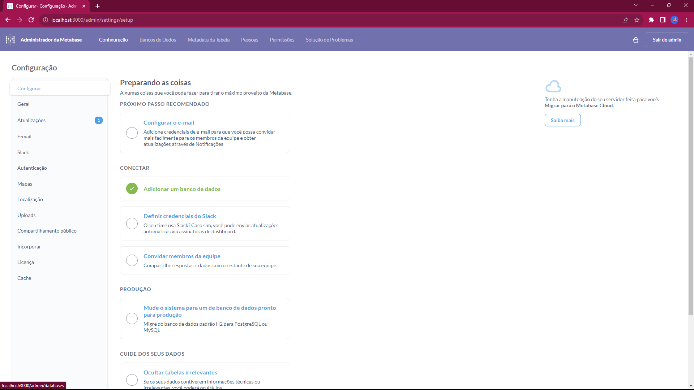

3. Clique em "Adicionar Banco de Dados."

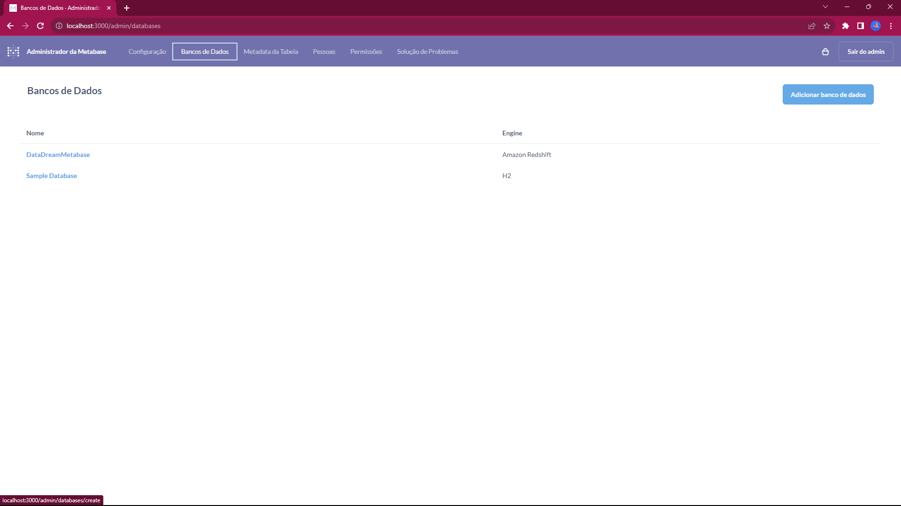

4. Preencha as informações do seu banco e clique em "Salvar."

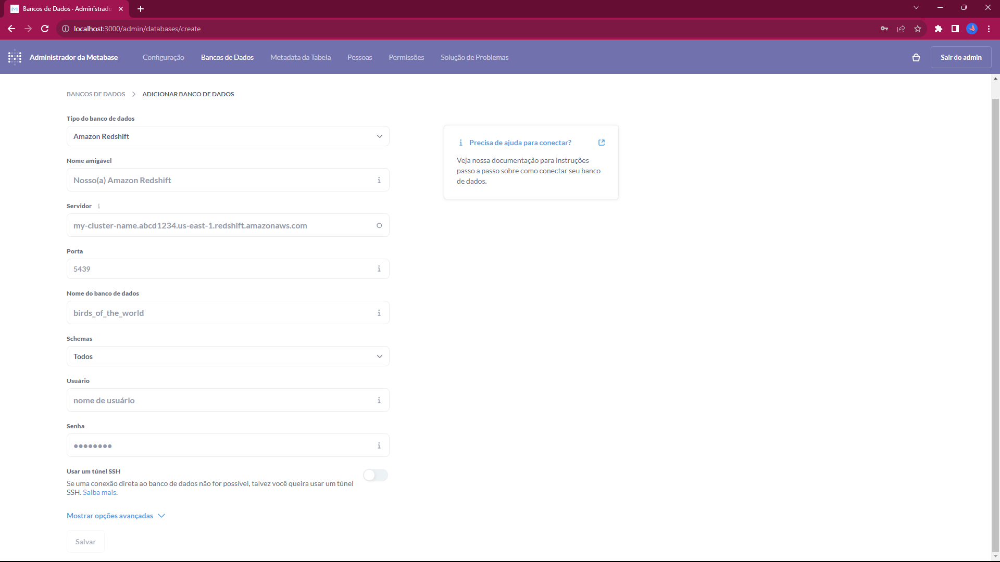

**Observação :** Se estiver utilizando o Redshift, as informações do servidor podem ser encontradas dentro do seu workgroup, sendo a URL do endpoint.

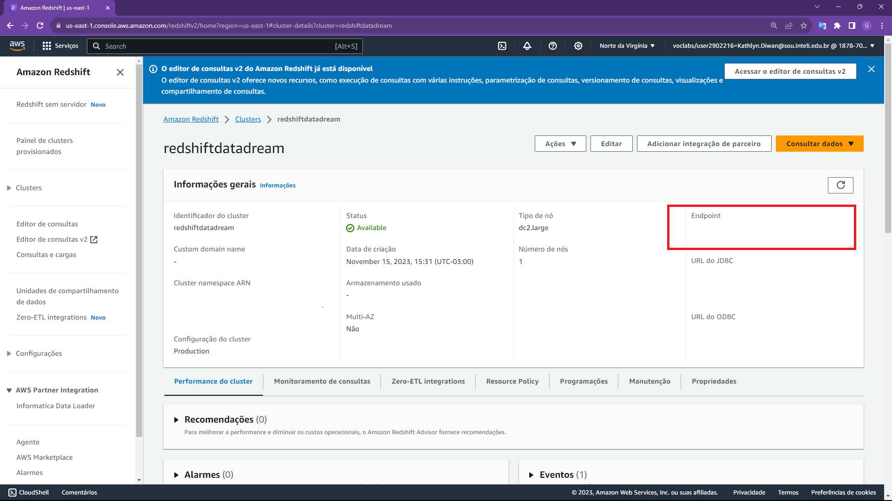

5. Aguarde a sincronização e a conexão será estabelecida com sucesso.

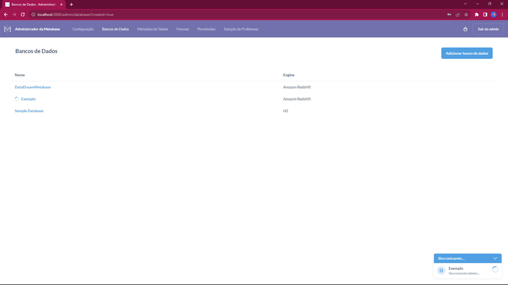

6. Aqui, o banco de dados "Exemplo" foi conectado com sucesso.

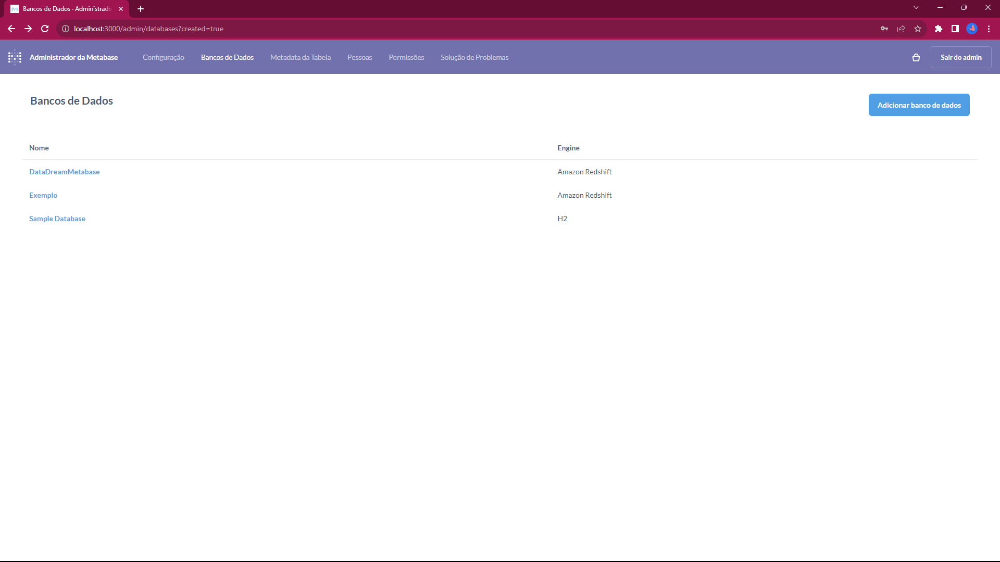


## 2.4. Visualização dos dados

Para visualizar os dados do banco criado, siga estes passos:

1. **Sair do Modo Administrativo:**  Clique em "Sair do ADM."

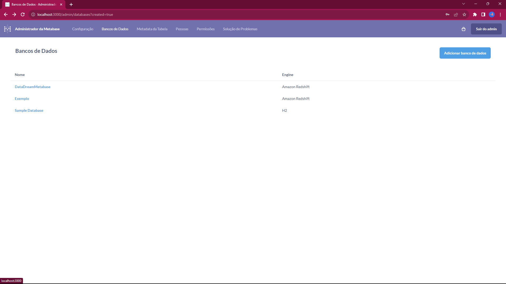


2. **Explorar Dados:** No menu principal, selecione "Explorar Dados."

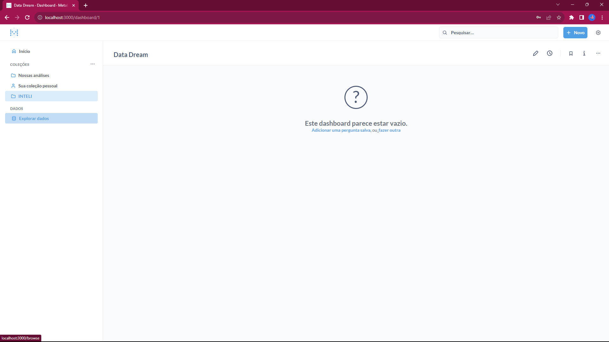


3. **Selecionar o Banco de Dados Criado:** No card do banco de dados "Exemplo" que criamos, clique para acessar.

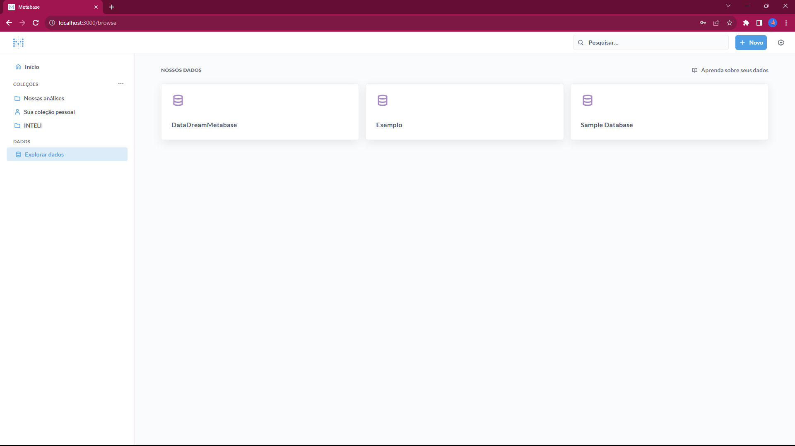


4. **Visualizar Dados Importados:** A página apresentará todos os dados importados da nossa conexão. No exemplo, os dados estavam carregados em um Redshift da AWS.

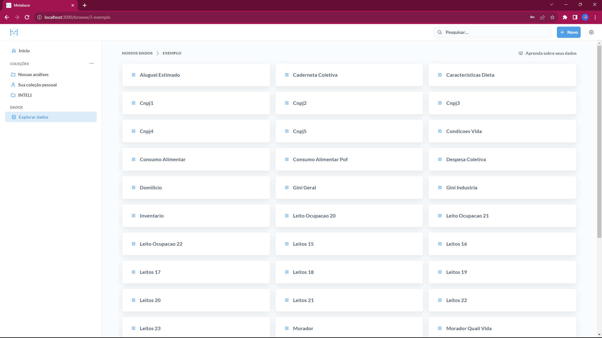

# <a name="c3"></a>3. Pontos fortes e fracos

Optamos por desenvolver gráficos que tivessem maior foco na consumação por canal, região e categoria justamente para podermos enxergar as oportunidades e desafios presentes no estado de consumo alimentar em diferentes regiões, fornecendo insights valiosos para a empresa de consultoria. 

## 3.1. Pontos Fortes <br> 
Os infográficos foram criados e desenvolvidos para servir como uma representação visual de informações ou dados complexos, projetada para tornar a compreensão e a assimilação dessas informações mais acessíveis e eficientes. Dessa forma, combinamos elementos gráficos, como gráficos, ícones e ilustrações, com texto conciso, os infográficos transformam dados densos em representações visuais atraentes e de fácil interpretação. <br> 

Dessa forma, os objetivos delineados para a concepção dos infográficos desenvolvidos por nossa equipe são nítidos e abrangentes, percorrendo desde a análise de canais e regiões até o delineamento do perfil do consumidor por estado. A diversidade nos tipos de gráficos e representações visuais adiciona valor significativo, proporcionando uma compreensão minuciosa dos dados e revelando insights específicos sobre consumo, características dos clientes, padrões sazonais e evolução das vendas, entre outros aspectos. <br> 

Nossos gráficos são enriquecidos pela incorporação de uma paleta variada de cores, cada uma destinada a representar informações distintas. O formato diferenciado das barras é estrategicamente adotado para simplificar a compreensão da narrativa visual, facilitando a identificação de tendências e padrões ao longo do tempo. Além disso, a implementação de filtros visa tornar o processo de interpretação mais intuitivo, oferecendo ao leitor a possibilidade de concentrar-se de maneira mais específica em áreas de interesse. Esses filtros proporcionam uma visualização mais coesa, permitindo a análise detalhada de categorias, consumo por região, UF, mês, venda total, entre outros parâmetros. <br> 
Em síntese, a abordagem adotada na criação desses infográficos visa não apenas clareza e acessibilidade, mas também uma compreensão aprofundada dos dados, aproveitando a diversidade de elementos visuais para contar uma história envolvente. O uso estratégico de cores, formatos e filtros colabora para uma experiência mais personalizada e direcionada, elevando a eficácia dessas representações visuais. <br> 

## 3.2. Pontos Fracos <br> 
Enfrentamos o desafio de lidar com um volume significativo de arquivos e dados, o que nos levou a desenvolver gráficos com a intenção de proporcionar representações visuais que contem a história de maneira mais eficaz. Contudo, torna-se evidente que, embora muitos possam analisar e extrair conclusões de nossos gráficos, há também um contingente de pessoas que pode encontrar dificuldades na interpretação. Isso resulta em possíveis áreas de confusão durante a visualização dos dados, seja devido a complexidades nas legendas ou na distinção de cores. Apesar dos esforços para minimizar erros e mal-entendidos, reconhecemos a inevitabilidade de eventuais interpretações equivocadas. <br> 

Além disso, reconhecemos a importância fundamental de uma limpeza e tratamento de dados adequados para a construção eficaz de gráficos. Embora tenhamos realizado um pré-processamento meticuloso dos arquivos disponíveis, é crucial ressaltar que, para futuras incorporações de diferentes conjuntos de dados pela empresa Integration, a fim de construir gráficos de qualidade, poderá ser necessário um tratamento adicional e cuidadoso. Essa tarefa pode demandar tempo considerável e atenção meticulosa, sendo um processo potencialmente laborioso.

# <a name="c4"></a>4. Descrição dos Gráficos

## 4.1. Dashboard Data Dream Integration <br> 

**Gráfico 1: Mapa do Índice de Vulnerabilidade Municipal - Pobreza Não Monetária  2017-2018 POR UF**

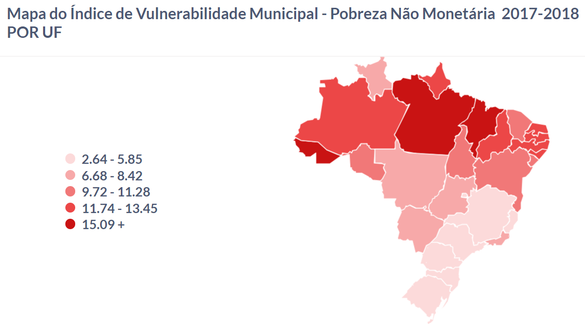 

Este gráfico é um mapa do Brasil dividido por estados, mostrando o Índice de Vulnerabilidade Municipal com foco em Pobreza Não Monetária no período de 2017 a 2018. As cores no mapa variam do rosa claro ao vermelho escuro, representando diferentes faixas do índice:

- Rosa claro: Índice de 2.64 a 5.85
- Rosa médio: Índice de 6.68 a 8.42
- Rosa escuro: Índice de 9.72 a 11.28
- Vermelho claro: Índice de 11.74 a 13.45
- Vermelho escuro: Índice de 15.09 ou mais

Cada cor corresponde a uma faixa do índice de vulnerabilidade, indicando que quanto mais escura a cor, maior o nível de pobreza não monetária no estado. Isso pode abranger fatores como acesso à educação, saúde, moradia e saneamento, entre outros.

**Gráfico 2: Comparativo Índice de Vulnerabilidade Municipal - Pobreza Não Monetária e Índice de Pobreza Multidimensional Não Monetária 2017-2018**

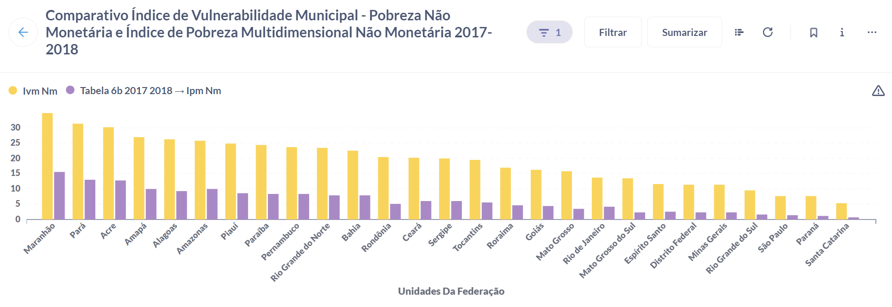 

Este gráfico é um histograma que compara dois índices diferentes de vulnerabilidade para os estados brasileiros (unidades da federação), mostrando dados de pobreza não monetária e pobreza multidimensional não monetária para o período de 2017-2018.

O gráfico exibe duas séries de barras para cada estado:

- As barras amarelas representam o Índice de Vulnerabilidade Municipal - Pobreza Não Monetária (Ivm Nm).
- As barras roxas representam os dados da "Tabela 6b 2017-2018 → Ipm Nm", que parece ser uma referência específica à fonte dos dados ou a uma metodologia específica de cálculo do índice.

As barras são ordenadas horizontalmente pelos estados do Brasil, começando com Maranhão no lado esquerdo e terminando com Santa Catarina no lado direito. A escala vertical é numérica de 0 a 30, indicando a magnitude dos índices.

Os estados com as barras mais altas, indicando maiores índices de vulnerabilidade, estão no lado esquerdo do gráfico, sugerindo maior pobreza não monetária e multidimensional não monetária nesses estados. Por outro lado, os estados do lado direito mostram barras significativamente mais baixas, sugerindo menores índices de vulnerabilidade.

**Gráfico 3: 10  alimentos mais consumidos por Classe**

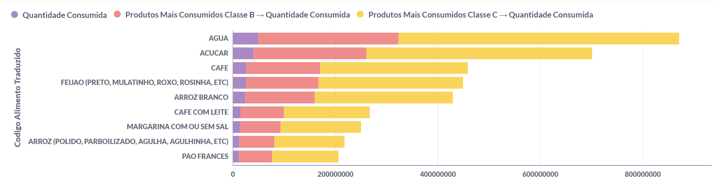 

O gráfico é um histograma horizontal que compara a quantidade consumida dos 10 alimentos mais consumidos por duas classes socioeconômicas diferentes, Classe B e Classe C, no Brasil.

Cada alimento é listado no eixo vertical, com o respectivo código/tradução do alimento à esquerda. Os itens listados, de cima para baixo, são:

- Água
- Açúcar
- Café
- Feijão (preto, mulatinho, roxo, rosinha, etc.)
- Arroz branco
- Café com leite
- Margarina com ou sem sal
- Arroz (polido, parboilizado, agulha, agulhinha, etc.)
- Pão francês
- Proteínas (não visível no gráfico)

No eixo horizontal, temos a quantidade consumida, representada por barras que se estendem da esquerda para a direita. As barras roxas representam a quantidade consumida pela Classe B, e as barras amarelas representam a quantidade consumida pela Classe C. Os números no eixo horizontal parecem estar na casa dos milhões, embora o número exato não seja visível.

A água possui a maior barra para ambas as classes, sugerindo que é o item mais consumido. Os demais alimentos têm barras de tamanhos variados, indicando diferenças no consumo entre as duas classes. Açúcar, café e feijão também mostram barras consideráveis, sugerindo que são bastante consumidos pelas classes B e C.

Este gráfico pode ser usado para analisar o padrão de consumo de alimentos entre diferentes classes socioeconômicas e possivelmente para informar estratégias de marketing e distribuição de produtos.

**Gráfico 4: Categorias mais recorrente nos 5 arquivos de Cnpj**

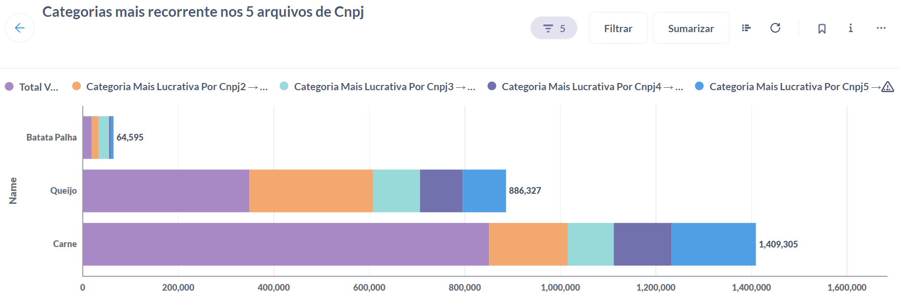 

O gráfico acima é um histograma horizontal que exibe as categorias mais recorrentes nos 5 arquivos de CNPJ, indicando, provavelmente, a frequência ou lucratividade de categorias específicas de produtos ou serviços.

As categorias são listadas no eixo vertical como "Batata Palha", "Queijo" e "Carne". No eixo horizontal, temos valores mostram uma medida quantitativa (possivelmente receita ou número de transações), com a escala variando de 0 até acima de 1.600.000.

Cada categoria possui até cinco barras coloridas diferentes, cada uma representando uma medida diferente de lucratividade por arquivo de CNPJ, como indicado pelos diferentes círculos de cor no canto superior esquerdo do gráfico:

A barra roxa representa o "Total Vendas".
Outras barras representam a categoria mais lucrativa por CNPJ2, CNPJ3, CNPJ4 e CNPJ5, cada uma com uma cor diferente.
Por exemplo, a categoria "Queijo" tem uma barra roxa muito longa, sugerindo um valor total alto, e várias outras barras coloridas de comprimento variado representando diferentes arquivos de CNPJ.

O gráfico mostra claramente que "Queijo" tem um valor total significativamente maior do que "Batata Palha" e "Carne", indicando que pode ser a categoria mais lucrativa ou com maior volume de vendas. O número exato para cada barra está indicado na extremidade direita das barras. Por exemplo, para "Queijo", o valor mais alto é de 886.327, e para "Carne", é de 1.409.305.

Este tipo de gráfico é útil para identificar quais categorias de produtos são mais lucrativas ou populares em diferentes conjuntos de dados de CNPJ, o que pode informar decisões estratégicas de negócios, como foco em vendas, marketing ou expansão de produto.

**Gráfico 5: Quantidade de estabelecimentos comerciais com atuação alimentícia por estado do Brasil.**

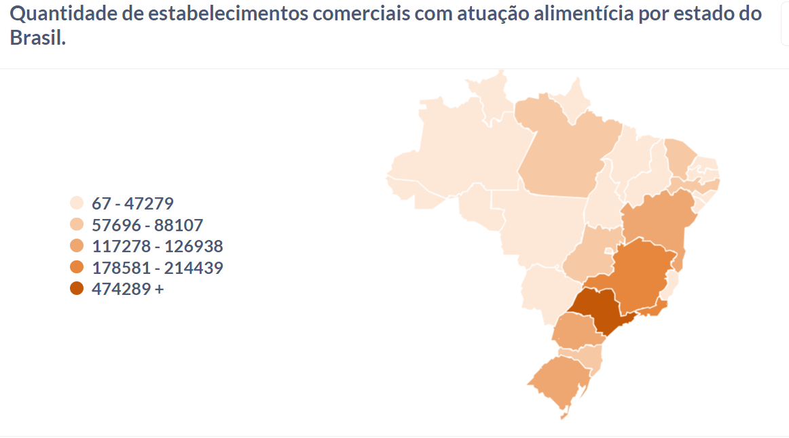 

O gráfico é um mapa coroplético do Brasil, que representa a quantidade de estabelecimentos comerciais com atuação alimentícia por estado. A legenda indica uma escala de cores que vai do bege claro ao marrom escuro, correspondendo a diferentes intervalos de quantidade de estabelecimentos:

- Bege claro representa entre 67 a 47.279 estabelecimentos.
- Um tom de pêssego mais intenso indica 57.696 a 88.107 estabelecimentos.
- Um tom de laranja mais escuro representa 117.278 a 126.938 estabelecimentos.
- Um laranja ainda mais escuro indica 178.581 a 214.439 estabelecimentos.
- E o marrom escuro, que é a cor mais intensa no mapa, representa 474.289 ou mais estabelecimentos.

Os estados do sul e sudeste do Brasil estão coloridos com tons mais escuros, indicando uma maior concentração de estabelecimentos comerciais com atuação alimentícia, enquanto que os estados do norte e nordeste estão em tons mais claros, indicando uma menor concentração desses estabelecimentos. O estado com a cor mais escura é São Paulo, sugerindo que este possui o maior número de estabelecimentos comerciais do setor alimentício em comparação com os outros estados.

**Gráfico 6: Top 3 classificações nacionais de atividades econômicas por estado do Brasil.**

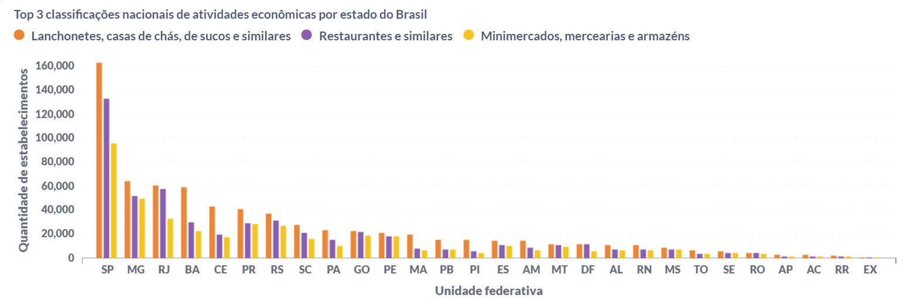 

Este gráfico de barras horizontais mostra o "Top 3 classificações nacionais de atividades econômicas por estado do Brasil". Há três conjuntos de barras, cada um representando uma categoria diferente de estabelecimento:

- Lanchonetes, casas de chás, de sucos e similares em laranja.
- Restaurantes e similares em roxo.
- Minimercados, mercearias e armazéns em amarelo.

Cada conjunto de barras está associado a uma unidade federativa do Brasil, e a altura das barras indica a quantidade de estabelecimentos em cada estado. São Paulo (SP) apresenta a maior altura em todas as três categorias, indicando a maior quantidade de estabelecimentos em cada uma delas. As unidades federativas estão dispostas no eixo horizontal, enquanto que o eixo vertical indica a quantidade de estabelecimentos, que varia de 0 a aproximadamente 160.000.

A diferença entre as categorias e estados é significativa. Por exemplo, em São Paulo, o número de lanchonetes, casas de chás, de sucos e similares é visivelmente maior do que as outras categorias, com a barra alcançando o ponto mais alto no gráfico. O padrão se repete, em menor escala, para os outros estados, com a maioria mostrando maior número de estabelecimentos na categoria de lanchonetes e similares, seguida por restaurantes e, por último, minimercados e mercearias. Os estados com as menores quantidades são Roraima (RR), Acre (AC) e Amapá (AP).

**Gráfico 7: Renda Bruta Mensal Total por UF.**

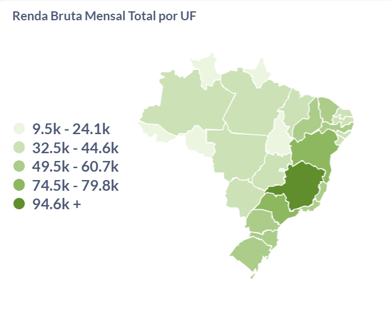 

O gráfico em questão é um mapa coroplético do Brasil, mostrando a renda bruta mensal total por unidade federativa (UF). As diferentes tonalidades de verde representam intervalos de renda, como indicado na legenda:

- Verde claro: renda entre 9.5k e 24.1k.
- Verde um pouco mais escuro: renda entre 32.5k e 44.6k.
- Verde médio: renda entre 49.5k e 60.7k.
- Verde escuro: renda entre 74.5k e 79.8k.
- Verde muito escuro: renda acima de 94.6k.

A intensidade da cor verde aumenta com a faixa de renda. O estado com a cor mais escura é Minas Gerais, indicando que é a UF com a maior renda bruta mensal total dentre as apresentadas. Os outros estados variam entre os tons de verde mais claros e médios, sugerindo faixas de renda menores em comparação com Minas Gerais.

## 4.2. Consulta com Filtros <br> 

**Gráfico 8: Renda Bruta Mensal Total por UF.**

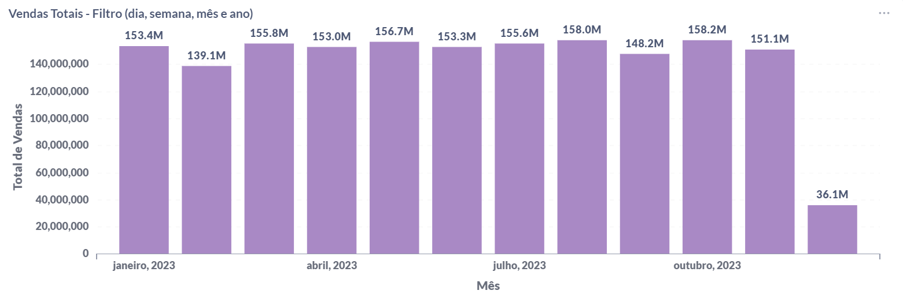 

Este gráfico de barras exibe as vendas totais mensais ao longo de diferentes meses no ano de 2023. As barras são coloridas de roxo, e cada barra representa um mês específico, com o valor de vendas total marcado no topo de cada barra.

O gráfico começa com janeiro de 2023, mostrando vendas de 153.4M. Abril tem um ligeiro aumento para 155.8M. Julho mostra uma pequena diminuição para 153.0M. A partir daqui, os meses não estão rotulados, mas seguindo a sequência trimestral anterior, podemos inferir que as próximas barras representam outubro, janeiro de 2024, abril de 2024, e assim por diante, com as vendas mostrando uma tendência de ligeira flutuação, mas mantendo-se em grande parte acima de 150M, exceto por uma queda acentuada na última barra visível, que cai para 36.1M.

## 4.3. Infográfico <br> 

**Gráfico 9: Vendas no Brasil de Batata Palha.**

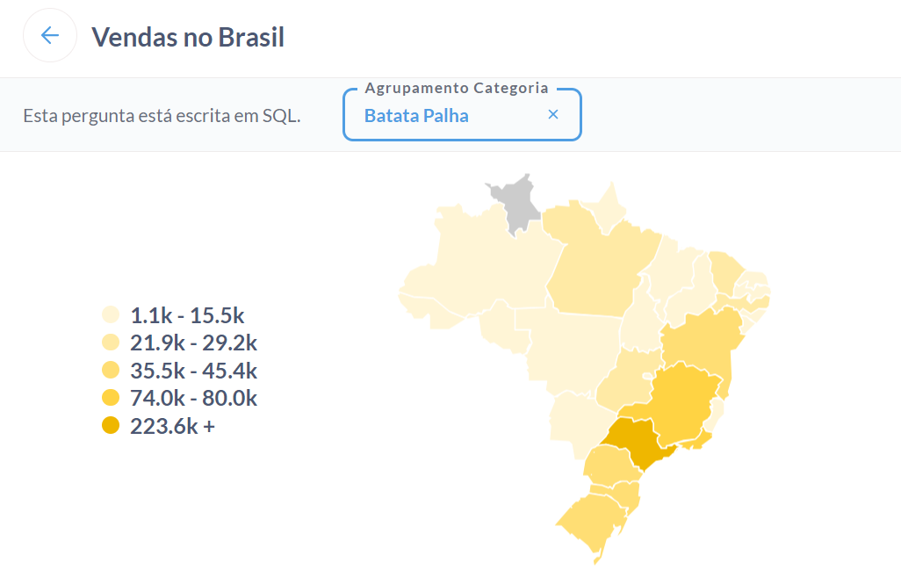 

O gráfico é um mapa coroplético do Brasil que mostra as vendas de um produto específico, "Batata Palha", por estado. A legenda do mapa utiliza uma gama de cores que vai do amarelo claro ao amarelo mais escuro para representar diferentes intervalos de vendas:

- Amarelo muito claro: 1.1k - 15.5k unidades vendidas.
- Amarelo claro: 21.9k - 29.2k unidades vendidas.
- Amarelo médio: 35.5k - 45.4k unidades vendidas.
- Amarelo escuro: 74.0k - 80.0k unidades vendidas.
- Amarelo muito escuro: mais de 223.6k unidades vendidas.

Os estados com vendas mais altas estão coloridos com um tom de amarelo mais escuro, sugerindo que o volume de vendas de "Batata Palha" é maior nesses locais. Por exemplo, um dos estados do sudeste tem o tom mais escuro, indicando que está na faixa de vendas mais alta. A maioria dos outros estados apresenta tons mais claros, indicando faixas de vendas inferiores.

**Gráfico 10: Categoria de produtos mais vendidos.**

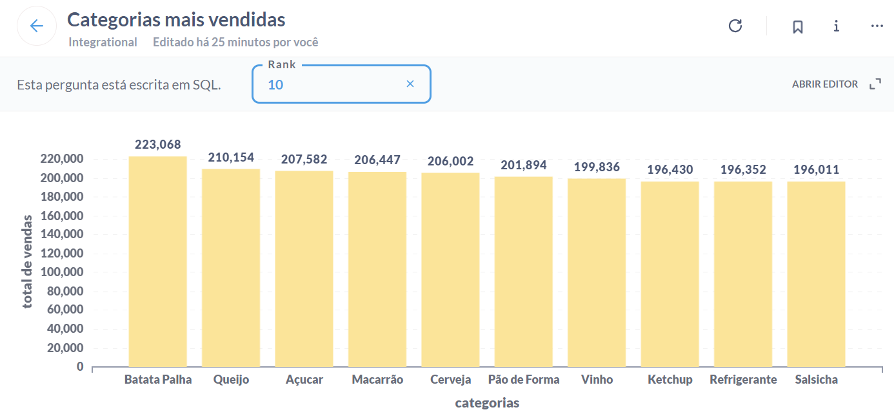 

Este gráfico é um gráfico de barras que exibe o total de vendas por categoria de produtos. As barras são coloridas em um tom de amarelo dourado, e cada barra representa uma categoria diferente, com a quantidade total de vendas marcada no topo de cada barra.

As categorias e os totais de vendas correspondentes, da esquerda para a direita, são:

- Batata Palha: 223,068 unidades
- Queijo: 210,154 unidades
- Açúcar: 207,582 unidades
- Macarrão: 206,447 unidades
- Cerveja: 206,002 unidades
- Pão de Forma: 201,894 unidades
- Vinho: 199,836 unidades
- Ketchup: 196,430 unidades
- Refrigerante: 196,352 unidades
- Salsicha: 196,011 unidades

O eixo vertical representa o total de vendas, variando de 0 a aproximadamente 220.000 unidades, enquanto o eixo horizontal lista as categorias de produtos. A categoria "Batata Palha" apresenta o maior número total de vendas, destacando-se das outras categorias. As vendas das outras categorias estão relativamente próximas umas das outras, com "Salsicha" apresentando o menor número total de vendas entre as categorias listadas.

**Gráfico 11: Vendas de Batata Palha no Estado de São Paulo.**

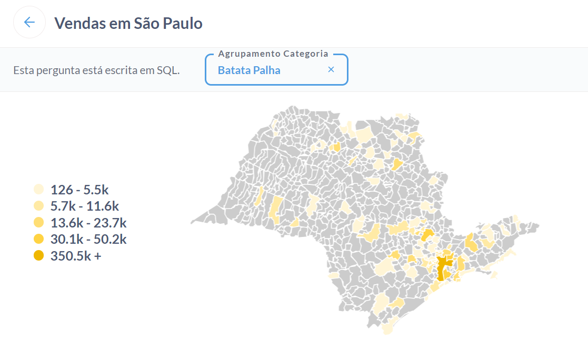 

O gráfico é um mapa coroplético da região de São Paulo, provavelmente detalhando as vendas do produto "Batata Palha" por município ou região dentro do estado. A legenda do mapa usa uma escala de cores que vai de um amarelo muito claro a um amarelo dourado mais intenso, representando diferentes intervalos de vendas:

- Amarelo muito claro: 126 - 5.5k unidades vendidas.
- Amarelo claro: 5.7k - 11.6k unidades vendidas.
- Amarelo médio: 13.6k - 23.7k unidades vendidas.
- Amarelo dourado: 30.1k - 50.2k unidades vendidas.
- Amarelo dourado intenso: 350.5k ou mais unidades vendidas.

As áreas mais escuras no mapa, que correspondem a maiores vendas, estão principalmente concentradas no centro-leste do estado, o que pode indicar regiões de alta densidade populacional ou de maior atividade comercial. A maior parte do estado apresenta os tons mais claros de amarelo, sugerindo volumes de vendas mais baixos.

**Gráfico 12: Vendas por Bairro de Batata Palha.**

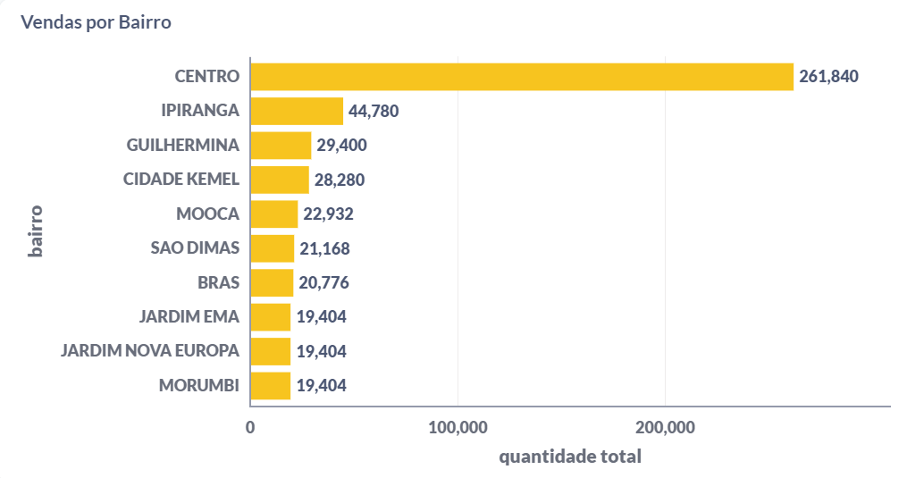 

Este gráfico de barras horizontais mostra as vendas totais por bairro. As barras, coloridas em amarelo dourado, representam a quantidade de vendas em cada bairro listado no eixo vertical. O eixo horizontal mostra a quantidade total de vendas.

Aqui estão os bairros e as vendas correspondentes, listados de cima para baixo:

- Centro: 261,840 unidades vendidas.
- Ipiranga: 44,780 unidades vendidas.
- Guilhermina: 29,400 unidades vendidas.
- Cidade Kemel: 28,280 unidades vendidas.
- Mooca: 22,932 unidades vendidas.
- São Dimas: 21,168 unidades vendidas.
- Brás: 20,776 unidades vendidas.
- Jardim Ema: 19,404 unidades vendidas.
- Jardim Nova Europa: 19,404 unidades vendidas.
- Morumbi: 19,404 unidades vendidas.

O bairro "Centro" tem uma barra significativamente mais longa do que os outros bairros, indicando uma quantidade muito maior de vendas. Os outros bairros têm valores de vendas relativamente próximos entre si.

**Gráfico 13: Vendas por Canal de Batata Palha no Estado de São Paulo.**

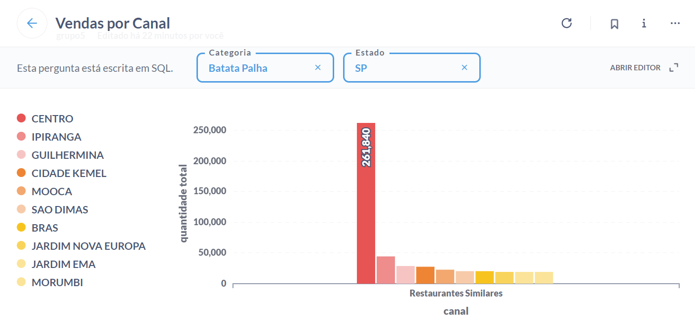 

O gráfico de barras verticais mostra as vendas de "Batata Palha" por canal em diferentes bairros do estado de São Paulo. Cada barra representa um bairro e é colorida de acordo com um gradiente que vai do vermelho ao amarelo, sugerindo diferentes quantidades de vendas.

As barras estão dispostas da esquerda para a direita com as seguintes quantidades:

- Centro: 261,840 unidades vendidas, destacada em vermelho escuro, indicando a maior quantidade de vendas.
- Ipiranga: uma quantidade significativamente menor em comparação com o Centro, em um tom de vermelho mais claro.
- Os outros bairros, como Guilhermina, Cidade Kemel, Mooca, São Dimas, Brás, Jardim Nova Europa, Jardim Ema e Morumbi, têm barras cada vez menores, com as cores transitando do vermelho para o amarelo, indicando uma diminuição progressiva nas vendas.

O bairro do Centro domina claramente as vendas para esse produto específico, com as outras regiões mostrando vendas muito menores. Isso pode indicar uma alta concentração de consumidores ou uma preferência particular por "Batata Palha" nesse bairro.

**Gráfico 14:Vendas mensal de Batata Palha no Estado de São Paulo.**

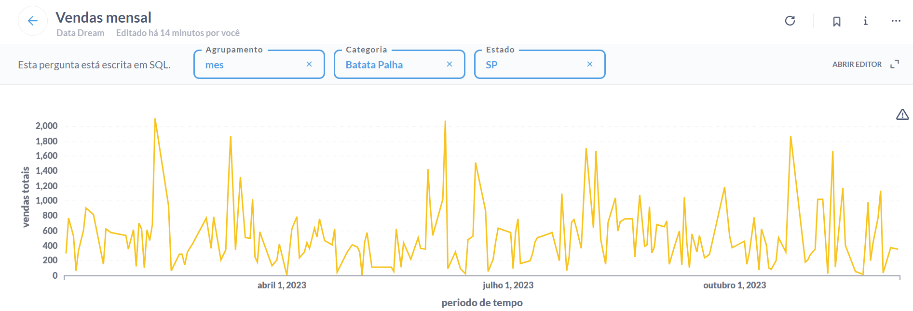 

O gráfico apresentado é um gráfico de linhas que mostra a quantidade de vendas mensais de "Batata Palha" no estado de São Paulo ao longo de um determinado período em 2023. A linha é colorida em amarelo dourado e exibe picos e vales, indicando flutuações nas vendas totais ao longo do tempo.

Há picos significativos que ultrapassam 1.800 unidades e vales que descem abaixo de 200 unidades. As vendas mostram uma variação considerável, com alguns meses tendo vendas muito altas e outros com vendas muito baixas.

Este padrão pode sugerir sazonalidade nas vendas ou eventos específicos que impulsionam ou reduzem as vendas em determinados períodos.

# <a name="c5"></a>5. Pontos de melhoria

O infográfico atual oferece uma representação visual dos dados relacionados ao consumo de alimentos em diferentes estados. No entanto, para aprimorar ainda mais a compreensão e a utilidade da informação, foram identificados alguns pontos de melhoria:

**Destaque de Alimentos por Cidade:**

Propõe-se a inclusão da funcionalidade para mostrar simultaneamente no gráfico de municípios qual alimento é mais consumido em cada cidade. Isso proporcionará uma visão mais clara das preferências alimentares regionais.

**Diferenciação Visual por Alimento:**

Recomenda-se a implementação de diferenciação por cores dos respectivos alimentos consumidos em cada cidade. Isso facilitará a identificação rápida e intuitiva das categorias alimentares predominantes, melhorando a experiência visual do usuário.

**Análise Específica de CNPJ:**

Sugere-se a incorporação de uma análise mais detalhada, focando na identificação dos CNPJs que não compraram deste parceiro específico. A consulta SQL fornecida pode ser utilizada para obter essas informações, destacando os dados relacionados à quantidade, preço e outros fatores relevantes.

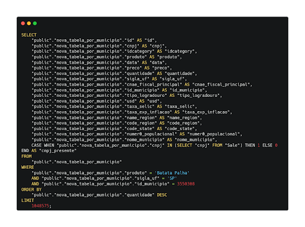

**Considerações sobre dados Fictícios:**

Observa-se que os dados da API do parceiro são fictícios. No entanto, para a aplicação prática do infográfico em um ambiente real, a sugestão é utilizar dados reais para aprimorar a precisão e utilidade do dashboard. 


# <a name="c6"></a>6. Testes do Infográfico/Dashboard

Para os testes do infográfico/dashboard, dividimos o grupo em dois, com 3 pessoas encarregadas da construção dos gráficos e outras 3 responsáveis por testá-los. Esses testes ocorreram no período de 13/12 a 20/12, revelando algumas áreas passíveis de aprimoramento.

1. A intuitividade dos filtros deixou a desejar.
2. Combinar cores semelhantes gerou confusão; cuidado na escolha das combinações.
3. Os gráficos de pilha podem ser interpretados de maneiras diferentes dependendo do usuário.

Os feedbacks foram coletados tanto dos alunos quanto do professor da disciplina, buscando insights para melhorias. Dos três pontos destacados, dois foram abordados com sucesso. As cores foram substituídas, e o gráfico de pilha foi aplicado apenas em um dos gráficos, facilitando a compreensão. No entanto, devido a limitações da plataforma, os filtros permaneceram inalterados. Para mitigar isso, foi criado um vídeo explicativo sobre sua utilização, disponível no link [aqui](https://youtu.be/W_Ipa7yyAzA).


# <a name="c7"></a>7. Referências

[Tópico 2 - Metabase Instalação e Configuração]

GITHUB. Grafico Metabase : Criar um data visualization com o Metabase(2023).Disponível em : https://github.com/furlan2803/Grafico_Pipeline_Metabase. Acesso em: 18 de Dezembro de 2023. 

# Observação:

Se não houver localizado informações pertinentes no presente documento, por favor, consulte o link a seguir, que direciona à documentação oficial.

<a href="https://docs.google.com/document/d/18IWwAVmbsr7sUm45ySdnJtWkj1H6QQnC/edit?usp=sharing&ouid=112389543027386593098&rtpof=true&sd=true">Documentação Oficial</a>