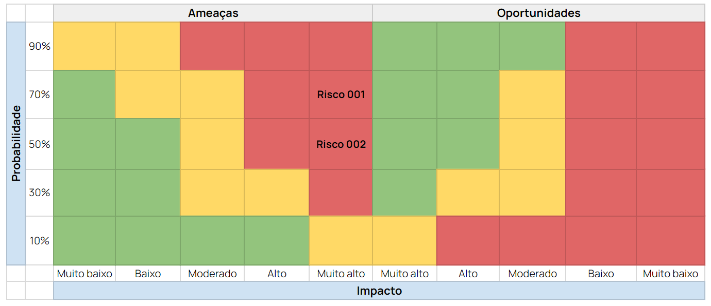

# Mapeamento dos riscos - Sprint 5

Imagem da matriz de risco desenvolvida pelo grupo.
Ela pode ser acessada em: <a href="https://docs.google.com/spreadsheets/d/1GaFcKPwhB-bUPlH9w4u_4tazs5Qccpc_o9DnrirDUmg/edit?usp=sharing">Matriz de risco</a>

## Risco 001

| Risco    | Descrição                                                                                                        |
|----------|------------------------------------------------------------------------------------------------------------------|
| 001      | Erros na interpretação dos resultados devido à complexidade dos dados. Se a arquitetura da solução proposta não for cuidadosamente planeada ou não atender às necessidades previamente definidas, existe a possibilidade de que o projeto não alcance uma escalabilidade satisfatória. Isso, por sua vez, compromete o resultado final e prejudica a viabilidade do uso futuro da solução por parte dos parceiros do projeto. À medida que a quantidade de dados a ser processada aumenta, é provável que enfrentemos desafios relacionados ao desempenho, armazenamento, processamento e distribuição dos dados.                                                |
| Probabilidade | 60%                                                                                                             |
| Impacto  | Muito alto                                                                                                       |
| Justificativa | A probabilidade deste risco é moderada, dada a complexidade dos dados. O impacto é muito alto, pois erros na  interpretação podem prejudicar o valor do projeto.                                                                |
| Plano de ação | Para mitigar esse risco, é necessário que a equipe busque capacitação em análise de dados, a fim de aprimorar a compreensão dos dados e das técnicas de análise. Além disso, é importante realizar uma validação cruzada de interpretações, envolvendo membros da equipe com diferentes perspectivas e conhecimentos. É fundamental manter uma documentação detalhada dos métodos de análise e resultados, tornando-a uma prática constante para garantir a transparência e facilitar a revisão por pares. Solicitar feedback dos stakeholders também é uma ação importante para assegurar que as descobertas estejam alinhadas com as necessidades e expectativas.                            |
| Responsável  | Izabella Faria e Giovanna Furlan.                                                                                |

## Risco 002

| Risco    | Descrição                                                                                                         |
|----------|-------------------------------------------------------------------------------------------------------------------|
| 002      | Falta de controle no gerenciamento das atividades individuais e do projeto. Na hipótese de o time enfrentar dificuldades na organização do cronograma e na mensuração do tempo necessário para desenvolver as tarefas estabelecidas devido ao grande volume de atividades que precisam ser realizadas, tanto no que diz respeito às tarefas individuais quanto às do time, isso pode resultar em atrasos nas entregas e no planejamento geral do projeto, prejudicando o seu progresso.                                                                     |
| Probabilidade | 50%                                                                                                              |
| Impacto  | Muito alto                                                                                                        |
| Justificativa | A probabilidade desse risco é moderada, uma vez que a organização do cronograma pode ser desafiadora em projetos  complexos com muitas tarefas. O impacto é alto, pois atrasos nas entregas das sprints podem impactar negativamente o progresso do projeto e a satisfação dos parceiros.                                                               |
| Plano de ação | Para mitigar esse risco, a equipe manterá uma gestão rigorosa do cronograma e priorização de tarefas. Será  estabelecida uma comunicação eficaz para garantir que todos os membros estejam cientes de suas responsabilidades e prazos. Além disso, a equipe considerará a possibilidade de redistribuir tarefas entre os membros, se necessário.   |
| Responsável  | João Marques, Maria Luíza.                                                                                         |

## Categorização dos riscos

Abaixo, é possível visualizar a classificação dos riscos. Além disso, disposto na tabela é possível visualizar os respectivos impactos e a probabilidade de ocorrência.

| Risco | Categoria | Impacto     | Probabilidade |
|-------|-----------|-------------|---------------|
| 001   | Equipe    | Muito alto  | 60%           |
| 002   | Equipe    | Muito alto  | 50%           |

Com base nos dados disponíveis, foi elaborado um gráfico que apresenta a distribuição dos riscos mapeados. Nesta última sprint, observou-se que apenas uma categoria persistiu, sendo esta relacionada aos riscos associados ao gerenciamento e compreensão interna da equipe. Portanto, é de suma importância dedicar atenção especial às necessidades e desafios da equipe, a fim de evitar que esses riscos se materializem em problemas reais no futuro.

Além disso, procedemos à classificação dos riscos com base em seu impacto no projeto. Nessa análise, constatamos que os riscos possuem um impacto de grande magnitude, o que evidencia a necessidade de adotar medidas substanciais para prevenir a materialização desses cenários.

# Observação:

Se não houver localizado informações pertinentes no presente documento, por favor, consulte o link a seguir, que direciona à documentação oficial.

<a href="https://docs.google.com/document/d/18IWwAVmbsr7sUm45ySdnJtWkj1H6QQnC/edit?usp=sharing&ouid=112389543027386593098&rtpof=true&sd=true">Documentação Oficial</a>