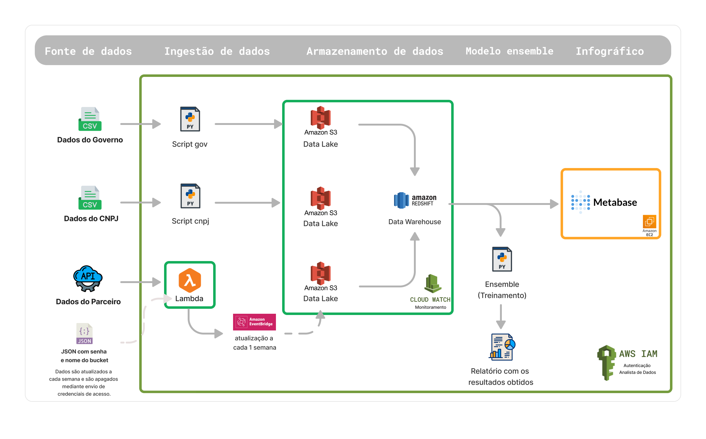
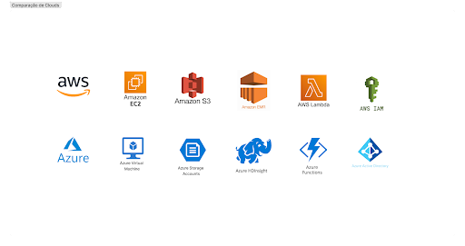

# 8. Arquitetura Macro

A arquitetura do sistema se refere às decisões que definem a estrutura e organização dos componentes que constituem a aplicação. Responsável por garantir que a aplicação seja escalável e segura. 

## 8.1 Requisitos do pipeline de dados

Um pipeline de dados é um conjunto de processos e ferramentas que permitem a coleta, processamento, armazenamento e análise de grandes volumes de dados. Apresenta-se abaixo os requisitos estabelecidos para este projeto: 

**Fontes de Dados:** Os dados provêm de três fontes distintas - dados de pesquisas do governo, informações de CNPJs e dados fornecidos pelo parceiro, a Integration.

**Volume de Dados:** O volume de dados varia dependendo das contribuições do parceiro e do crescimento contínuo ao longo dos anos nos dados governamentais e de CNPJs. Em média, se planeja suportar um volume de dados que varia de 6 a 10 gigabytes nesta aplicação.

**Velocidade de Ingestão:** Os dados são transmitidos via streaming, onde os fluxos são processados durante a visualização das informações do infográfico. A arquitetura foi projetada com serviços que garantem esse processamento ágil.

**Transformação e Processamento:** Os dados chegam em um formato não estruturado e, durante o processamento, eles são transformados em tabelas estruturadas. Além disso, aplica-se procedimentos de limpeza, verificação de integridade e remoção de dados indesejáveis, incluindo aqueles de origem estrangeira.

**Armazenamento:** O armazenamento dos dados ocorre em um banco de dados relacional, hospedado na AWS Cloud. No entanto, a arquitetura foi concebida para permitir a portabilidade para outras plataformas de nuvem, fazendo amplo uso de serviços de código aberto.

**Segurança:**  A segurança é mantida por meio de autenticação, com dois níveis distintos. O primeiro nível é para acesso às informações do infográfico, enquanto o segundo abrange toda a parte técnica dos dados, incluindo ingestão, armazenamento e análise estatística. Para implementação utiliza-se o AWS IAM, o que proporciona a flexibilidade de migrar esse serviço para outras plataformas de nuvem, caso necessário.

**Escalabilidade:**  Com foco na escalabilidade e na gestão da demanda, após o processamento, os dados são armazenados em um banco de dados OLAP. Mesmo com grandes volumes de dados, se consegue gerenciar as requisições, pela arquitetura ser modular.

## 8.2. Identificação dos dados de entrada e saída

A identificação dos dados de entrada e saída é utilizada para esclarecer como os dados fluem através do sistema.  

### 8.2.1 Dados de Entrada

**Fontes de Dados:** 
- Dados de pesquisas do governo;
- Dados de CNPJs;
- Dados fornecidos pelo parceiro.

**Formato dos Dados de Entrada:** Os dados de entrada são, em sua maioria, não estruturados e podem incluir textos, números e informações variadas.

**Método de Ingestão:**  Os dados de entrada são transmitidos em tempo real por meio de um sistema de ingestão de dados via batch.

### 8.2.2 Dados de Saída

**Infográfico:** A principal saída da aplicação é a apresentação de um infográfico, que oferece insights visuais com base nos dados processados.

**Formato dos Dados de Saída:** Os dados de saída serão apresentados em um formato visual, como gráficos.

**Destino dos Dados de Saída:** Os dados processados e transformados são exibidos ao usuário final por meio de uma interface.

## 8.3. Análise das necessidades e objetivos do pipeline

A análise das necessidades e objetivos do pipeline auxilia na definição das diretrizes e no planejamento do sistema. Esta seção detalha as necessidades e metas do pipeline de dados:

### 8.3.1 Necessidades

**Coleta de Dados:** O pipeline deve ser capaz de coletar dados de fontes diversas, como dados governamentais, CNPJs e dados do parceiro, de forma confiável, garantindo a integridade e qualidade dos dados.

**Processamento:** Dada a geração do infográfico, é essencial processar dados em tempo real para fornecer insights atualizados aos usuários.

**Transformação e Limpeza de Dados:** É necessário aplicar transformações e limpeza aos dados não estruturados, incluindo a estruturação em tabelas e a remoção de dados indesejáveis.

**Armazenamento:** Os dados processados devem ser armazenados de forma segura em um banco de dados relacional hospedado na AWS Cloud, garantindo que estejam disponíveis quando necessário.

**Portabilidade e Flexibilidade:** A arquitetura deve ser projetada para permitir a portabilidade para outras nuvens, fazendo uso de serviços de código aberto, caso haja necessidade de migração futura.

**Segurança em Duas Camadas:** Implementação de dois níveis de segurança, com autenticação para acesso às informações do infográfico e autenticação separada para as operações técnicas do pipeline, garantindo a segurança contra acessos não autorizados.

**Escalabilidade:** A arquitetura deve ser escalável para acomodar volumes de dados crescentes e manter o desempenho, mesmo com um grande volume de informações.

### 8.3.2 Objetivos

**Infográfico:** O principal objetivo é fornecer um infográfico interativo que apresenta informações de forma visual e acessível aos usuários.

**Tomada de Decisão:** Auxiliar na tomada de decisões com base nas informações apresentadas no infográfico.

**Migração Simples:** Permitir a migração dos serviços para outras plataformas de nuvem, a fim de garantir a continuidade dos negócios em outros ambientes.

**Gerenciamento de Dados:**  Gerenciar os dados de forma a armazenar em um banco de dados OLAP, além de usar containers Docker para manutenção modularizada.

## 8.4. Escolha de serviços adequados para cada etapa do pipeline

### 8.4.1 Fonte de Dados

**Dados Governamentais:** Dados em formato csv de fontes governamentais e sites para pegar novos dados quando tiver atualizações ou para consultas futuras.

**Dados do CNPJ:** Dados de empresas em formato csv, incluindo informações sobre CNPJ, setor e localização.

**Dados do Parceiro:** Informações de parceiros externos através da API, requisições GET.

### 8.4.2 Automação de Ingestão

**Scripts python:** Scripts python que recebem os dados em formato csv, realizam o pré-processamento desses dados e automatizam o seu envio para buckets do Amazon S3.

**API com Lambda:** Script python que se conecta com a API do parceiro com um intervalo de uma semana. Este, coleta os dados fornecidos por meio de um lambda e realiza o envio para um bucket do Amazon S3, que será excluído mediante interesse das partes envolvidas. 

### 8.4.3 Preparação e Armazenamento:

**AWS S3 (Data lake):** Serviço de armazenamento escalável da AWS para dados brutos antes do processamento.

**Redshift (Data warehouse):** Serviço de armazenamento escalável da AWS para dados previamente tratados e prontos para a utilização.

### 8.4.4 Análise estatística

**Modelo ensemble:** modelo ensemble utilizando python para verificação da existência de padrões entre os dados utilizados.

### 8.4.5 Infográfico

**Metabase:** ferramenta de Business Intelligence que simplifica a análise de dados e a tomada de decisões por meio da criação de infográficos e relatórios personalizados.

### 8.4.6 Segurança

**AWS IAM (Identity and Access Management):** Gerencia a autenticação de usuários, controlando o acesso aos recursos da AWS, garantindo a segurança dos dados e recursos.

## 8.5. Escolha dos serviços

A escolha dos serviços nesta arquitetura de Big Data foi planejada considerando principalmente a portabilidade, a ênfase na AWS como principal nuvem, a flexibilidade de custos e a otimização de recursos. Abaixo apresenta separado em tópicos a justificativa para essa seleção:

**Portabilidade:** A maior parte dos serviços foi escolhida com a portabilidade em mente, evitando depender de soluções proprietárias. Isso permite que a arquitetura seja facilmente migrada para outras plataformas de nuvem, se necessário. 

**Uso de Open Source:** A preferência por tecnologias de código aberto proporciona flexibilidade e custos potencialmente mais baixos.

**AWS Cloud:**  A AWS foi escolhida como a principal nuvem para atender ao escopo inicial do projeto. No entanto, a arquitetura foi planejada de forma a ser portável, o que significa que, se o cliente decidir migrar para outra nuvem no futuro, a transição será suave e eficiente, minimizando a interrupção dos serviços.

**Flexibilidade de Custos:** Dado que o cliente não estabeleceu um orçamento específico para a arquitetura, a escolha de serviços também considerou a otimização de custos. A seleção de ferramentas de código aberto e a capacidade de dimensionar recursos conforme necessário permitem que o cliente controle e otimize os custos à medida que o projeto evolui. 

## 8.6. Representação visual do pipeline

A arquitetura proposta atende às necessidades da Integration, fornecendo um sistema que lida com a aquisição e análise de dados de consumo de produtos alimentícios, resultando na criação de infográficos informativos. Esta arquitetura é projetada para abranger todo o processo, desde a coleta de dados a partir de diversas fontes até a entrega de infográficos prontos para análise.

Figura: Arquitetura
Fonte: Criação própria (Arquitetura)

A seguir, apresenta-se uma comparação dos serviços utilizados na arquitetura que atualmente fazem uso da infraestrutura na nuvem da AWS, juntamente com suas correspondentes alternativas na nuvem da Azure. Essa comparação assume que o cliente planeja realizar a migração para a plataforma Azure em um momento futuro, exigindo uma compreensão das alternativas disponíveis para uma transição suave.

Figura: Comparação AWS x Azure
Fonte: Criação própria

## 8.7. Boas práticas - resiliência e escalabilidade

Garantir a resiliência e escalabilidade é fundamental em qualquer arquitetura de Big Data para lidar com o crescimento de dados e as demandas variáveis. Apresenta-se abaixo as medidas tomadas nesse projeto: 

**Arquitetura Modularizada:** A arquitetura foi projetada de forma modular, com componentes independentes que podem ser escalados e mantidos separadamente. Isso permite que recursos sejam alocados onde mais são necessários, sem impactar o funcionamento de todo o sistema.

**Serviços de Nuvem:** O uso de serviços em nuvem, como AWS S3 e AWS EC2, proporciona uma escalabilidade sob demanda, permitindo expandir ou reduzir recursos conforme necessário. Além disso, essas plataformas oferecem alta disponibilidade e redundância, contribuindo para a resiliência.

**Recuperação de falhas:** Planejar estratégias de recuperação de falhas, como redundância de dados e backups regulares, para garantir a recuperação eficaz em caso de problemas. 

## 8.8. Serviços ou recursos da AWS - resiliência e escalabilidade

Ao projetar esta arquitetura de Big Data, foram incorporados serviços e recursos da Amazon Web Services (AWS) que contribuem para garantir a resiliência e escalabilidade do pipeline de dados:

**Amazon S3:** Serviço de armazenamento escalável, fornece redundância de dados e replicação entre várias zonas de disponibilidade.

**AWS Lambda:** Permite a execução de código em resposta a eventos. Ele pode ser usado para lidar com tarefas de processamento de dados, com base na demanda.

**AWS Identity and Access Management (IAM):**  Utilizado para a segurança e a resiliência da arquitetura, permitindo o gerenciamento de permissões e a autenticação dos usuários, garantindo o acesso controlado aos recursos da AWS.

# Observação:

Se não houver localizado informações pertinentes no presente documento, por favor, consulte o link a seguir, que direciona à documentação oficial.

<a href="https://docs.google.com/document/d/18IWwAVmbsr7sUm45ySdnJtWkj1H6QQnC/edit?usp=sharing&ouid=112389543027386593098&rtpof=true&sd=true">Documentação Oficial</a>